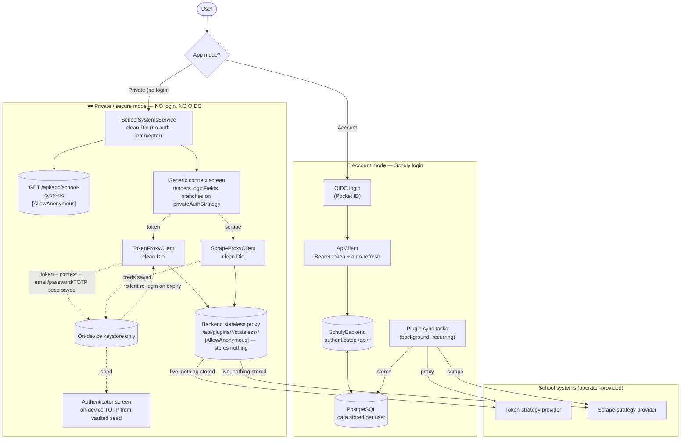

# App modes: Account vs Private (secure)

Schuly runs in one of two modes, chosen at the gate. Both read the same
operator-provided school systems and the same backend-served catalog; the
difference is **who authenticates** and **where the data rests**. The app is
provider-agnostic — concrete systems are catalog data, never hardcoded.

|                     | 🔐 Account mode                | 🕶️ Private / secure mode                          |
| ------------------- | ------------------------------ | ------------------------------------------------- |
| Auth to Schuly      | OIDC (Pocket ID) bearer        | **none**                                          |
| HTTP client         | `ApiClient` (auth interceptor) | clean `Dio`, anonymous endpoints only             |
| Where data lives    | server-side in Postgres        | **on-device only**                                |
| Backend role        | stores + background-syncs      | live stateless proxy, stores nothing              |
| Provider selection  | per connected account          | catalog `privateAuthStrategy` (`token` / `scrape`) |
