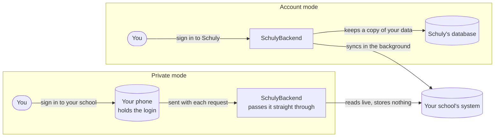

# App modes: Account vs Private (secure)

Schuly runs in one of two modes, chosen at the gate. Both read the same school
systems from the same backend catalog; the difference is **who signs the user in**
and **where the data ends up**. No school system is hardcoded in the app - every one
of them comes from the catalog.

Both modes end up reading the same school system. What differs is where your login is
kept and whether any of the data comes to rest on a server.

```mermaid
flowchart LR
  subgraph account["Account mode"]
    direction TB
    AU(["You"]) -->|"sign in to Schuly"| AB["SchulyBackend"]
    AB -->|"keeps a copy of your data"| ADB[("Schuly's database")]
  end

  subgraph private["Private mode"]
    direction TB
    PU(["You"]) -->|"sign in to your school"| PP[("Your phone<br/>holds the login")]
    PP -->|"sent with each request"| PB["SchulyBackend<br/>passes it straight through"]
  end

  School[("Your school's system")]
  AB -->|"syncs in the background"| School
  PB -->|"reads live, stores nothing"| School
```

## What private mode does on the device

- The school login is written to the **device keystore** and never leaves it, apart from
  being sent to the school system through the backend's anonymous proxy endpoints.
- The connect screen is generic: it renders whatever login fields the catalog lists for
  your school, and follows the `privateAuthStrategy` it declares - `token` (a headless
  login mints a bearer token and a refreshable session) or `scrape` (the credentials are
  replayed on each fetch).
- If your school uses a one-time code, its seed is vaulted with the rest, and the
  **Authenticator** screen generates codes on the device.
- When a session expires, the app re-connects silently from the keystore, so you are not
  asked to sign in again.

|                     | Account mode                | Private / secure mode                          |
| ------------------- | ------------------------------ | ------------------------------------------------- |
| Auth to Schuly      | OIDC (Keycloak) bearer        | **none**                                          |
| HTTP client         | `ApiClient` (auth interceptor) | clean `Dio`, anonymous endpoints only             |
| Where data lives    | server-side in Postgres        | **on-device only**                                |
| Backend role        | stores + background-syncs      | live stateless proxy, stores nothing              |
| Provider selection  | per connected account          | catalog `privateAuthStrategy` (`token` / `scrape`) |
