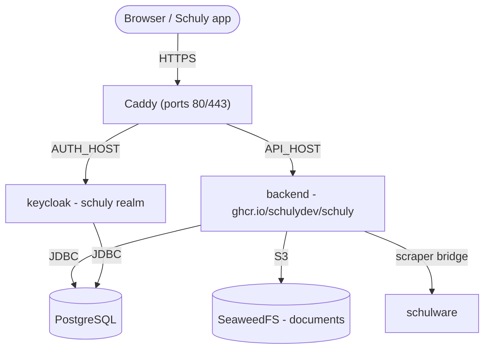

# Self-hosting (step by step)

A from-zero walkthrough to stand up the Schuly backend **and the services it needs**
on your own server, using the published GHCR images and the ready-made stack under
[`deploy/`](https://github.com/schulydev/SchulyBackend/tree/main/deploy). Everything
runs behind [Caddy](https://caddyserver.com/) with automatic HTTPS.

For local development instead, see [Development](development.md). For image/release
details and the full settings list, see [Production](production.md) and
[Configuration](configuration.md).

## What you'll run



| Service | Image | Exposed |
|---|---|---|
| `caddy` | `caddy:2` | **80 / 443** - the only public ports |
| `backend` | `ghcr.io/schulydev/schuly` | via Caddy → `https://${API_HOST}` |
| `keycloak` | `ghcr.io/schulydev/schulykeycloak` | via Caddy → `https://${AUTH_HOST}` |
| `postgres` | `postgres:18.1` | internal (databases `schuly` and `keycloak`) |
| `seaweedfs` | `chrislusf/seaweedfs` | internal - S3 document storage |
| `schulware` | `ghcr.io/pianonic/schulwareapi` | internal - Schulnetz bridge for the Schulware plugin |

The backend validates OIDC tokens against the Keycloak `schuly` realm, applies its EF
Core migrations automatically on startup, and downloads the plugins declared in
`config/plugins.yml` from the registry (no plugin DLLs are baked into the image).

## Prerequisites

- A Linux server with **Docker** and the **Compose plugin** (`docker compose`).
- Ports **80** and **443** open to the internet.
- Two DNS records pointing at the server - one for the API, one for Keycloak
  (e.g. `api.schuly.example` and `auth.schuly.example`). Caddy needs them resolvable
  before first start so Let's Encrypt can issue certificates.

## 1. Get the deploy files

Clone the repo (or copy just its `deploy/` folder) onto the server and enter it:

```sh
git clone https://github.com/schulydev/SchulyBackend.git
cd SchulyBackend/deploy
```

Everything below runs from `deploy/`.

## 2. Point DNS at the server

Create A/AAAA records for your two hostnames and wait for them to resolve to the
server's public IP. Until they do, certificate issuance will fail.

## 3. Configure secrets

Copy the template and fill it in:

```sh
cp .env.example .env
```

| Variable | What to set |
|---|---|
| `API_HOST` | Public hostname for the API, e.g. `api.schuly.example`. |
| `AUTH_HOST` | Public hostname for Keycloak, e.g. `auth.schuly.example`. |
| `POSTGRES_USER` | Database user (shared by the backend and Keycloak). |
| `POSTGRES_PASSWORD` | A strong database password. |
| `KC_ADMIN_USER` | Keycloak bootstrap admin username (master realm). |
| `KC_ADMIN_PASSWORD` | Keycloak bootstrap admin password. |
| `S3_ACCESS_KEY` | SeaweedFS S3 access key. |
| `S3_SECRET_KEY` | SeaweedFS S3 secret key. |
| `AVATAR_SIGNING_KEY` | HMAC key for signing avatar URLs (required). Generate with `openssl rand -hex 32`. |

> The S3 credentials **must match** `config/seaweedfs/s3-config.json` - update both
> the `.env` and that file to the same values, or document storage won't authenticate.

## 4. (Optional) Review the plugins

`config/plugins.yml` lists the plugins the backend loads on startup (the Schulware
plugin by default), and `config/plugins-config/` holds each plugin's configuration.
Each plugin also **provides its own school-system catalog entry** - the system the
app shows in its picker (Schulware contributes `schulnetz`, OdaOrg `odaorg`) - so
installing a plugin adds its system automatically, with no catalog config. The
defaults work out of the box; adjust only if you need to.

## 5. Start the stack

```sh
docker compose -f compose.staging.yml up -d
docker compose -f compose.staging.yml logs -f backend
```

On first start: Postgres creates the `schuly` and `keycloak` databases, Keycloak
imports the `schuly` realm, the backend applies its migrations and seeds the
school-systems catalog from the loaded plugins, and Caddy obtains TLS certificates
for both hostnames.

## 6. Verify end-to-end

- `https://${AUTH_HOST}` → the Keycloak admin console. Log in to the master realm with
  `KC_ADMIN_USER` / `KC_ADMIN_PASSWORD`; the `schuly` realm should already exist.
- `https://${API_HOST}/api/app/school-systems` → the anonymous catalog endpoint,
  proving the API is up (`/api/app` is the only unauthenticated route).
- `https://${API_HOST}/api/app` → the app config (also anonymous); its `version` field
  reports the running backend version - handy for confirming a deploy or upgrade.
- `https://${API_HOST}/api/plugins` → loaded plugins (requires an `Administrator`
  login). Manage at runtime with `POST /api/plugins/install` and
  `DELETE /api/plugins/{name}`.
- Point the Schuly app at `https://${API_HOST}`. Its login drives Keycloak via the
  `schuly-app` client; because the app and the backend both use `https://${AUTH_HOST}`
  as the OIDC authority, the token issuer matches and validation passes.

## 7. Harden for production

The bundled `schuly` realm ships a **starter** `schuly-app` PKCE client and the
Student / Teacher / Administrator groups (mapped to the `groups` claim the backend
reads as roles). Before real use:

- Replace the starter realm with a proper export, and rotate every secret in `.env`.
- Create a real Keycloak admin and remove the `KC_ADMIN_*` bootstrap variables (see
  the SchulyKeycloak project's self-hosting docs for the Keycloak-specific steps).
- Keep the management/internal services unexposed - only Caddy should publish ports.

## Operations

- **Persistence** - all state is **bind-mounted to host folders under `./data`** (no
  named volumes): `data/postgres`, `data/seaweedfs`, `data/plugins`, `data/caddy*`.
  This is the recommended setup - your data stays visible and easy to back up on the
  host. The folders are created on first `up`, and a one-shot `init-perms` service
  makes `data/plugins` writable by the backend's user automatically, so it just works
  on first run. To wipe, stop the stack and delete `./data`.
- **Upgrades** - pin image tags (e.g. `ghcr.io/schulydev/schuly:<semver>`) instead of
  `latest` for reproducible deploys, then `up -d` to roll forward. Migrations run
  automatically on the new container; back up `data/postgres` before major jumps.
- **Plugin changes** made through the API are persisted back to `config/plugins.yml`.

## Reference: the full `compose.staging.yml`

For convenience, the complete stack this guide runs (the same file lives in the
repo's `deploy/` folder). All state is bind-mounted under `./data` - no named
volumes - and a one-shot `init-perms` service makes the plugins folder writable by
the backend on first start, so a plain `docker compose up` just works.

```yaml
services:
  # One-shot: make the bind-mounted plugins folder writable by the backend's
  # non-root user (uid 1654) before it starts, so a plain `up` works first run.
  init-perms:
    image: busybox:1.37
    command: sh -c "mkdir -p /data/plugins && chown -R 1654:1654 /data/plugins"
    volumes:
      - ./data:/data
    restart: "no"

  postgres:
    image: postgres:18.1
    restart: unless-stopped
    environment:
      POSTGRES_USER: ${POSTGRES_USER}
      POSTGRES_PASSWORD: ${POSTGRES_PASSWORD}
      POSTGRES_DB: schuly
    volumes:
      # postgres:18 stores data in a versioned subdir, so mount at /var/lib/postgresql.
      - ./data/postgres:/var/lib/postgresql
      - ./config/postgres-init:/docker-entrypoint-initdb.d:ro
    healthcheck:
      test: ["CMD-SHELL", "pg_isready -U ${POSTGRES_USER} -d schuly"]
      interval: 10s
      timeout: 5s
      retries: 10

  seaweedfs:
    image: chrislusf/seaweedfs:latest
    restart: unless-stopped
    command: >
      server -dir=/data
      -s3 -s3.config=/etc/seaweedfs/s3-config.json -s3.port=8333
      -master.volumeSizeLimitMB=1024
    volumes:
      - ./data/seaweedfs:/data
      - ./config/seaweedfs/s3-config.json:/etc/seaweedfs/s3-config.json:ro

  keycloak:
    image: ghcr.io/schulydev/schulykeycloak:latest
    restart: unless-stopped
    environment:
      KC_DB: postgres
      KC_DB_URL: jdbc:postgresql://postgres:5432/keycloak
      KC_DB_USERNAME: ${POSTGRES_USER}
      KC_DB_PASSWORD: ${POSTGRES_PASSWORD}
      KC_HOSTNAME: https://${AUTH_HOST}
      KC_HTTP_ENABLED: "true"
      KC_PROXY_HEADERS: xforwarded
      KC_BOOTSTRAP_ADMIN_USERNAME: ${KC_ADMIN_USER}
      KC_BOOTSTRAP_ADMIN_PASSWORD: ${KC_ADMIN_PASSWORD}
    depends_on:
      postgres:
        condition: service_healthy

  schulware:
    image: ghcr.io/pianonic/schulwareapi:latest
    restart: unless-stopped
    init: true
    ipc: host
    environment:
      PYTHONUNBUFFERED: "1"

  backend:
    image: ghcr.io/schulydev/schuly:latest
    restart: unless-stopped
    environment:
      ASPNETCORE_ENVIRONMENT: Production
      ASPNETCORE_HTTP_PORTS: "8080"
      ConnectionStrings__SchulyDatabase: "Host=postgres;Port=5432;Database=schuly;Username=${POSTGRES_USER};Password=${POSTGRES_PASSWORD}"
      Oidc__Authority: "https://${AUTH_HOST}/realms/schuly"
      Oidc__ClientId: "schuly-app"
      Oidc__RequireHttpsMetadata: "true"
      # Mobile app deep link (the in-code default is the web localhost:4200 callback).
      Oidc__RedirectUri: "schulytest://callback"
      Oidc__PostLogoutRedirectUri: "schulytest://callback"
      Avatar__SigningKey: ${AVATAR_SIGNING_KEY}
      S3__Endpoint: "http://seaweedfs:8333"
      S3__Bucket: "schuly"
      S3__AccessKey: ${S3_ACCESS_KEY}
      S3__SecretKey: ${S3_SECRET_KEY}
      S3__UsePathStyle: "true"
      Plugins__Directory: "/app/plugins"
      Plugins__ConfigDirectory: "/app/plugins-config"
      Plugins__File: "/app/plugins.yml"
    volumes:
      - ./data/plugins:/app/plugins
      - ./config/plugins.yml:/app/plugins.yml
      - ./config/plugins-config:/app/plugins-config:ro
    depends_on:
      postgres:
        condition: service_healthy
      init-perms:
        condition: service_completed_successfully

  caddy:
    image: caddy:2
    restart: unless-stopped
    ports:
      - "80:80"
      - "443:443"
    environment:
      API_HOST: ${API_HOST}
      AUTH_HOST: ${AUTH_HOST}
    volumes:
      - ./Caddyfile:/etc/caddy/Caddyfile:ro
      - ./data/caddy:/data
      - ./data/caddy-config:/config
    depends_on:
      - backend
      - keycloak
```

