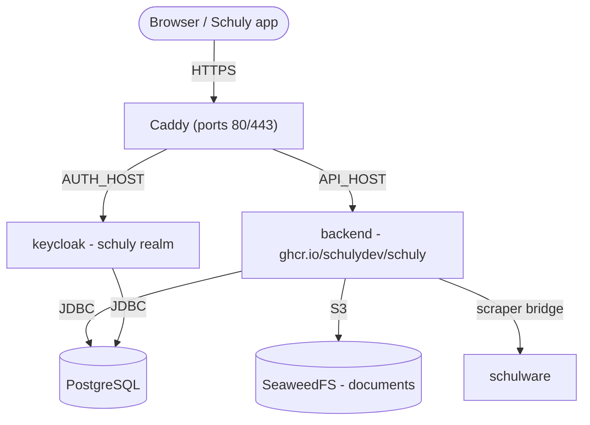

# Self-hosting

A from-zero walkthrough to stand up the Schuly backend **and the services it needs**
on your own server, using the published GHCR images and the ready-made stack under
[`deploy/`](https://github.com/schulydev/SchulyBackend/tree/main/deploy). Everything
runs behind [Caddy](https://caddyserver.com/) with automatic HTTPS.

For local development instead, see [Development](development.md). For image/release
details and the full settings list, see [Production](production.md) and
[Configuration](configuration.md).

## What you'll run


```mermaid
flowchart TB
    user([Browser / Schuly app]) -->|HTTPS| caddy["Caddy (ports 80/443)"]
    caddy -->|API_HOST| backend["backend - ghcr.io/schulydev/schuly"]
    caddy -->|AUTH_HOST| kc["keycloak - schuly realm"]
    backend -->|JDBC| pg[("PostgreSQL")]
    kc -->|JDBC| pg
    backend -->|S3| s3[("SeaweedFS - documents")]
    backend -->|scraper bridge| sw["schulware"]
```

| Service | Image | Exposed |
|---|---|---|
| `caddy` | `caddy:2` | **80 / 443** - the only public ports |
| `backend` | `ghcr.io/schulydev/schuly` | via Caddy → `https://${API_HOST}` |
| `keycloak` | `ghcr.io/schulydev/schulykeycloak` | via Caddy → `https://${AUTH_HOST}` |
| `postgres` | `postgres:18.1` | internal (databases `schuly` and `keycloak`) |
| `seaweedfs` | `chrislusf/seaweedfs` | internal - S3 document storage |
| `schulware` | `ghcr.io/pianonic/schulwareapi` | internal - Schulnetz bridge for the Schulware plugin |

The backend validates OIDC tokens against the Keycloak `schuly` realm, applies its EF
Core migrations automatically on startup, and downloads the plugins declared in
`config/plugins.yml` from the registry (no plugin DLLs are baked into the image).

## Prerequisites

- A Linux server with **Docker** and the **Compose plugin** (`docker compose`).
- Ports **80** and **443** open to the internet.
- Two DNS records pointing at the server - one for the API, one for Keycloak
  (e.g. `api.schuly.example` and `auth.schuly.example`). Caddy needs them resolvable
  before first start so Let's Encrypt can issue certificates.

## 1. Get the deploy files

Clone the repo (or copy just its `deploy/` folder) onto the server and enter it:

```sh
git clone https://github.com/schulydev/SchulyBackend.git
cd SchulyBackend/deploy
```

Everything below runs from `deploy/`, which looks like this before you've touched
anything:

```
deploy/
├── .env.example
├── Caddyfile
├── compose.staging.yml
├── config/
│   ├── backend.env
│   ├── keycloak.env
│   ├── plugins.yml
│   ├── plugins-config/
│   │   └── Schuly.Plugin.Schulware.yml
│   ├── postgres-init/
│   │   └── 01-create-keycloak-db.sh
│   └── seaweedfs/
│       └── s3-config.json
└── README.md
```

By the end of this guide you'll also have `.env` (step 3, from `.env.example`) and a
`data/` folder (created automatically on first `up`, step 5) holding everything the
stack persists:

```
deploy/
├── .env                  # ← you create this
├── ...                   #   (unchanged files omitted)
└── data/                 # ← created on first `docker compose up`
    ├── postgres/
    ├── seaweedfs/
    ├── plugins/           # downloaded plugin DLLs
    ├── caddy/              # TLS certificates/state
    └── caddy-config/
```

## 2. Point DNS at the server

Create A/AAAA records for your two hostnames and wait for them to resolve to the
server's public IP. Until they do, certificate issuance will fail.

## 3. Configure secrets

Copy the template and fill it in:

```sh
cp .env.example .env
```

| Variable | What to set |
|---|---|
| `API_HOST` | Public hostname for the API, e.g. `api.schuly.example`. |
| `AUTH_HOST` | Public hostname for Keycloak, e.g. `auth.schuly.example`. |
| `SCHULY_VERSION` | Backend image tag. `latest` follows every release; pin a version like `1.3.3` to decide yourself when to move. |
| `KEYCLOAK_VERSION` | Keycloak image tag, same idea. |
| `POSTGRES_USER` | Database user (shared by the backend and Keycloak). |
| `POSTGRES_PASSWORD` | A strong database password. |
| `KC_ADMIN_USER` | Keycloak bootstrap admin username (master realm). |
| `KC_ADMIN_PASSWORD` | Keycloak bootstrap admin password. |
| `S3_ACCESS_KEY` | SeaweedFS S3 access key. |
| `S3_SECRET_KEY` | SeaweedFS S3 secret key. |
| `AVATAR_SIGNING_KEY` | HMAC key for signing avatar URLs (required). Generate with `openssl rand -hex 32`. |
| `SMTP_HOST`, `SMTP_PORT`, `SMTP_FROM`, `SMTP_USER`, `SMTP_PASSWORD`, `SMTP_SSL`, `SMTP_STARTTLS` | Optional. Mail server for the Keycloak realm - needed for verified emails and self-service password reset. |

> The S3 credentials **must match** `config/seaweedfs/s3-config.json` - update both
> the `.env` and that file to the same values, or document storage won't authenticate.

> The `SMTP_*` values are baked into the realm when it is **first** imported. Changing
> them later has no effect on an existing realm - edit **Realm settings → Email** in the
> Keycloak admin console instead. Leaving them unset is fine; the realm then imports
> with no working mail server.

### Where the rest of the settings live

`.env` holds what changes per deployment. The two applications' own settings sit next to
the other config files, and read `${...}` values straight out of `.env`:

| File | Holds |
|---|---|
| [`config/backend.env`](https://github.com/schulydev/SchulyBackend/blob/main/deploy/config/backend.env) | Backend settings - database connection, OIDC, S3, plugin paths. |
| [`config/keycloak.env`](https://github.com/schulydev/SchulyBackend/blob/main/deploy/config/keycloak.env) | Keycloak settings - database, hostname, proxy headers, bootstrap admin, SMTP. |

You normally don't touch either; they exist so `compose.staging.yml` stays readable as a
picture of the stack rather than a wall of environment variables.

## 4. (Optional) Review the plugins

`config/plugins.yml` lists the plugins the backend loads on startup (the Schulware
plugin by default), and `config/plugins-config/` holds each plugin's configuration.
Each plugin also **provides its own school-system catalog entry** - the system the
app shows in its picker (Schulware contributes `schulnetz`, OdaOrg `odaorg`) - so
installing a plugin adds its system automatically, with no catalog config. The
defaults work out of the box; adjust only if you need to.

## 5. Start the stack

```sh
docker compose -f compose.staging.yml up -d
docker compose -f compose.staging.yml logs -f backend
```

On first start: Postgres creates the `schuly` and `keycloak` databases, Keycloak
imports the `schuly` realm, the backend applies its migrations and seeds the
school-systems catalog from the loaded plugins, and Caddy obtains TLS certificates
for both hostnames.

## 6. Verify end-to-end

- `https://${AUTH_HOST}` → the Keycloak admin console. Log in to the master realm with
  `KC_ADMIN_USER` / `KC_ADMIN_PASSWORD`; the `schuly` realm should already exist.
- `https://${API_HOST}/api/app/school-systems` → the anonymous catalog endpoint,
  proving the API is up (`/api/app` is the only unauthenticated route).
- `https://${API_HOST}/api/app` → the app config (also anonymous); its `version` field
  reports the running backend version - handy for confirming a deploy or upgrade.
- `https://${API_HOST}/api/plugins` → loaded plugins (requires an `Administrator`
  login). Manage at runtime with `POST /api/plugins/install` and
  `DELETE /api/plugins/{name}`.
- Point the Schuly app at `https://${API_HOST}`. Its login drives Keycloak via the
  `schuly-app` client; because the app and the backend both use `https://${AUTH_HOST}`
  as the OIDC authority, the token issuer matches and validation passes.

## 7. Create your first login

The bootstrap admin (`KC_ADMIN_USER` / `KC_ADMIN_PASSWORD`) signs into Keycloak's
**master realm** only - the admin console, not the Schuly app itself. To get a login
that works in the app, create a user in the **schuly** realm:

1. In the Keycloak admin console, switch the realm selector (top left) from `master`
   to `schuly`.
2. **Users → Add user.** Set a username (and email, if you configured SMTP).
3. **Credentials tab → Set password.** Turn off "Temporary" unless you want to be
   prompted to change it on first login.
4. **Groups tab → Join group.** Add the user to `Student`, `Teacher`, or
   `Administrator` - the backend reads the `groups` claim as the app role, and only
   `Administrator` can manage plugins through the API.

That user can now sign in from the Schuly app in Private mode - point it at
`https://${API_HOST}` and it drives Keycloak from there.

## 8. Harden for production

The bundled `schuly` realm ships a **starter** `schuly-app` PKCE client and the
Student / Teacher / Administrator groups (mapped to the `groups` claim the backend
reads as roles). Before real use:

- Replace the starter realm with a proper export, and rotate every secret in `.env`.
- Create a real Keycloak admin and remove the `KC_ADMIN_*` bootstrap variables (see
  the SchulyKeycloak project's self-hosting docs for the Keycloak-specific steps).
- Keep the management/internal services unexposed - only Caddy should publish ports.

## Running without a public domain (LAN / local testing)

Everything above assumes a real domain with DNS you control, so Caddy can get you a
Let's Encrypt certificate. If you just want to run the stack on your own network -
testing against a phone over Wi-Fi, no domain, no TLS - a few things change.

**Keycloak signs tokens with a fixed issuer URL (`KC_HOSTNAME`), and the backend
validates incoming tokens by fetching metadata from that exact URL.** So whatever you
put in `API_HOST`/`AUTH_HOST` has to resolve **identically** for the backend
container and for whatever's running your app (phone, browser, emulator) - if they
land on different addresses, the issuer won't match and every login fails.

Two ways to get a stable hostname without a real domain:

- **Your machine's LAN IP, used directly** - `API_HOST=AUTH_HOST=192.168.1.42`, no
  hostname at all. Simplest, and reachable from a phone on the same Wi-Fi. Docker
  Desktop reliably lets a container reach a port published on the host's own LAN IP
  (a "hairpin" connection back out through the host and in again), so the backend can
  still reach Keycloak this way with no extra network wiring - confirmed working in
  practice. Downside: breaks if the IP changes (new DHCP lease), and it's only
  reachable from that network.
- **A wildcard-DNS hostname pointed at your LAN IP**, e.g. `<ip>.nip.io` or
  `<ip>.sslip.io` - these publicly resolve straight back to the IP encoded in the
  name. Nicer than a raw IP, but **many consumer routers block it**: DNS-rebind
  protection (on by default on most FritzBox/AVM routers, among others) refuses to
  resolve a public hostname that points at a private address, so the name won't
  resolve for anyone on that network at all. If lookups mysteriously fail with no
  useful error, this is almost always why - fall back to the raw IP instead.

With either option, since `API_HOST` and `AUTH_HOST` are now the same address, Caddy
can no longer tell the two services apart by hostname - use distinct ports instead.

### Worked example

Say your machine's LAN IP is `192.168.1.42`. Nothing about the `deploy/` folder
structure from step 1 changes - you're editing four of the existing files in place,
nothing more:

```
deploy/
├── .env                  ← create from .env.example; API_HOST/AUTH_HOST = the LAN IP
├── Caddyfile              ← edit: plain HTTP, explicit ports, no hostname routing
├── compose.staging.yml    ← edit: caddy service ports
├── config/
│   ├── backend.env        ← edit: RequireHttpsMetadata=false
│   ├── keycloak.env        (unchanged - KC_HTTP_ENABLED is already true)
│   ├── plugins.yml         (unchanged)
│   ├── plugins-config/
│   │   └── Schuly.Plugin.Schulware.yml   (unchanged)
│   ├── postgres-init/
│   │   └── 01-create-keycloak-db.sh      (unchanged)
│   └── seaweedfs/
│       └── s3-config.json                (unchanged)
└── data/                  (created on first `up`, same as the domain case)
```

**`.env`** - same template as step 3, just point both hostnames at the raw IP and
leave `SMTP_*` commented out for a quick test:

```sh
API_HOST=192.168.1.42
AUTH_HOST=192.168.1.42
SCHULY_VERSION=latest
KEYCLOAK_VERSION=latest
POSTGRES_USER=schuly
POSTGRES_PASSWORD=change-me-postgres
KC_ADMIN_USER=admin
KC_ADMIN_PASSWORD=change-me-kc-admin
S3_ACCESS_KEY=schuly-access
S3_SECRET_KEY=change-me-s3-secret
AVATAR_SIGNING_KEY=change-me-avatar-signing-key
```

**`Caddyfile`** - replace the whole file (the domain-based version obtains a TLS cert
per hostname; this one just proxies by port):

```
http://{$API_HOST}:8080 {
	reverse_proxy backend:8080
}
http://{$AUTH_HOST}:8081 {
	reverse_proxy keycloak:8080
}
```

**`compose.staging.yml`** - in the `caddy` service, swap the `ports:` list (drop
`443:443`, there's no certificate to serve):

```yaml
  caddy:
    image: caddy:2
    restart: unless-stopped
    ports:
      - "8080:8080"
      - "8081:8081"
    environment:
      API_HOST: ${API_HOST}
      AUTH_HOST: ${AUTH_HOST}
    volumes:
      - ./Caddyfile:/etc/caddy/Caddyfile:ro
      - ./data/caddy:/data
      - ./data/caddy-config:/config
    depends_on:
      - backend
      - keycloak
```

**`config/backend.env`** - one line changes, from `true` to `false`:

```
Oidc__RequireHttpsMetadata=false
```

Then start it exactly as in step 5:

```sh
docker compose -f compose.staging.yml up -d
docker compose -f compose.staging.yml logs -f backend
```

And verify with the same checks as step 6, just `http://` and a port instead of
`https://`:

```sh
curl http://192.168.1.42:8080/api/app/school-systems       # anonymous catalog
curl http://192.168.1.42:8081/realms/schuly/.well-known/openid-configuration
```

The second command's `"issuer"` field in the response should read back exactly
`http://192.168.1.42:8081/realms/schuly` - if it doesn't match what your app/browser
is using to reach Keycloak, that's the mismatch described above, and login will fail.

Everything else - DNS-independent steps like realm import, plugin loading, and the
first-login walkthrough above - works exactly the same. One more thing worth knowing:
Windows Firewall may silently block a phone on the same Wi-Fi from reaching these
ports the first time - allow Docker Desktop on the **Private network** if prompted, or
add an inbound rule for the ports yourself.

## Operations

- **Persistence** - all state is **bind-mounted to host folders under `./data`** (no
  named volumes): `data/postgres`, `data/seaweedfs`, `data/plugins`, `data/caddy*`.
  This is the recommended setup - your data stays visible and easy to back up on the
  host. The folders are created on first `up`, and a one-shot `init-perms` service
  makes `data/plugins` writable by the backend's user automatically, so it just works
  on first run. To wipe, stop the stack and delete `./data`.
- **Upgrades** - set `SCHULY_VERSION` and `KEYCLOAK_VERSION` in `.env` to a fixed version
  rather than `latest`, so a deploy repeats exactly and you choose when to move. Change
  the version, then `up -d` to roll forward. Migrations run automatically on the new
  container; back up `data/postgres` before major jumps.
- **Plugin changes** made through the API are persisted back to `config/plugins.yml`.

## Reference: the full `compose.staging.yml`

For convenience, the complete stack this guide runs (the same file lives in the
repo's `deploy/` folder). All state is bind-mounted under `./data` - no named
volumes - and a one-shot `init-perms` service makes the plugins folder writable by
the backend on first start, so a plain `docker compose up` just works.

```yaml
services:
  # One-shot: make the bind-mounted plugins folder writable by the backend's
  # non-root user (uid 1654) before it starts, so a plain `up` works on the very
  # first run with no manual chown. Runs once and exits.
  init-perms:
    image: busybox:1.37
    command: sh -c "mkdir -p /data/plugins && chown -R 1654:1654 /data/plugins"
    volumes:
      - ./data:/data
    restart: "no"

  postgres:
    image: postgres:18.1
    restart: unless-stopped
    environment:
      POSTGRES_USER: ${POSTGRES_USER}
      POSTGRES_PASSWORD: ${POSTGRES_PASSWORD}
      POSTGRES_DB: schuly
    # Creates the extra `keycloak` database on first init (the backend's plugin
    # databases are created automatically by EF migrations).
    volumes:
      # postgres:18 stores data in a versioned subdir, so the data mounts at
      # /var/lib/postgresql (not /var/lib/postgresql/data, which it now rejects).
      - ./data/postgres:/var/lib/postgresql
      - ./config/postgres-init:/docker-entrypoint-initdb.d:ro
    healthcheck:
      # -h 127.0.0.1 forces a TCP check. While the entrypoint runs the init
      # scripts it serves on the Unix socket only, so a socket-based check would
      # report healthy mid-init and let dependents connect to a server that is
      # about to restart.
      test: ["CMD-SHELL", "pg_isready -U ${POSTGRES_USER} -d schuly -h 127.0.0.1"]
      interval: 10s
      timeout: 5s
      retries: 10

  seaweedfs:
    image: chrislusf/seaweedfs:latest
    restart: unless-stopped
    command: >
      server -dir=/data
      -s3 -s3.config=/etc/seaweedfs/s3-config.json -s3.port=8333
      -master.volumeSizeLimitMB=1024
    volumes:
      - ./data/seaweedfs:/data
      - ./config/seaweedfs/s3-config.json:/etc/seaweedfs/s3-config.json:ro

  keycloak:
    image: ghcr.io/schulydev/schulykeycloak:${KEYCLOAK_VERSION:-latest}
    restart: unless-stopped
    env_file: [./config/keycloak.env]
    depends_on:
      postgres:
        condition: service_healthy

  schulware:
    image: ghcr.io/pianonic/schulwareapi:latest
    restart: unless-stopped
    init: true        # reap zombie processes
    ipc: host         # shared memory headroom for the scraper
    environment:
      # Schulnetz client id + PWA host are baked into the SchulwareAPI image as
      # defaults, so no Schulnetz config is needed here.
      PYTHONUNBUFFERED: "1"

  backend:
    image: ghcr.io/schulydev/schuly:${SCHULY_VERSION:-latest}
    restart: unless-stopped
    env_file: [./config/backend.env]
    volumes:
      - ./data/plugins:/app/plugins                        # downloaded plugin DLLs (host folder)
      - ./config/plugins.yml:/app/plugins.yml              # desired plugin set (writable: endpoints rewrite it)
      - ./config/plugins-config:/app/plugins-config:ro     # per-plugin config
    depends_on:
      postgres:
        condition: service_healthy
      init-perms:
        condition: service_completed_successfully

  caddy:
    image: caddy:2
    restart: unless-stopped
    ports:
      - "80:80"
      - "443:443"
    environment:
      API_HOST: ${API_HOST}
      AUTH_HOST: ${AUTH_HOST}
    volumes:
      - ./Caddyfile:/etc/caddy/Caddyfile:ro
      - ./data/caddy:/data
      - ./data/caddy-config:/config
    depends_on:
      - backend
      - keycloak
```

