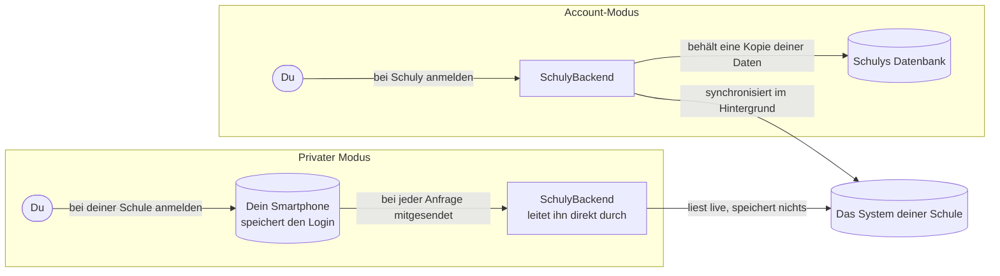

# App-Modi

Schuly läuft in einem von zwei Modi, die am Gate gewählt werden. Beide lesen dieselben
Schulsysteme aus demselben Backend-Katalog; der Unterschied liegt darin, **wer den
Nutzer anmeldet** und **wo die Daten landen**. Kein Schulsystem ist in der App fest
codiert - jedes davon stammt aus dem Katalog.

Beide Modi greifen letztlich auf dasselbe Schulsystem zu. Was sich unterscheidet, ist,
wo dein Login aufbewahrt wird und ob überhaupt Daten auf einem Server landen.

## Was der private Modus auf dem Gerät macht

- Der Schul-Login wird im **Keystore des Geräts** gespeichert und verlässt ihn nie -
  ausser wenn er über die anonymen Proxy-Endpunkte des Backends an das Schulsystem
  gesendet wird.
- Der Verbindungsbildschirm ist generisch: Er rendert genau die Login-Felder, die der
  Katalog für deine Schule vorgibt, und folgt der deklarierten
  `privateAuthStrategy` - `token` (ein Headless-Login erzeugt ein Bearer-Token und eine
  erneuerbare Session) oder `scrape` (die Zugangsdaten werden bei jedem Abruf erneut
  verwendet).
- Nutzt deine Schule einen Einmalcode, wird dessen Seed zusammen mit den übrigen Daten
  im Tresor abgelegt, und der **Authenticator**-Bildschirm erzeugt die Codes direkt auf
  dem Gerät.
- Läuft eine Session ab, verbindet sich die App aus dem Keystore heraus still neu, sodass
  du nicht erneut zur Anmeldung aufgefordert wirst.

|                     | Account-Modus                  | Privater / sicherer Modus                          |
| ------------------- | ------------------------------ | --------------------------------------------------- |
| Authentifizierung bei Schuly | OIDC (Keycloak) Bearer | **keine**                                           |
| HTTP-Client         | `ApiClient` (Auth-Interceptor) | reiner `Dio`, nur anonyme Endpunkte                 |
| Wo die Daten liegen | serverseitig in Postgres       | **nur auf dem Gerät**                               |
| Rolle des Backends  | speichert + synchronisiert im Hintergrund | Live-Stateless-Proxy, speichert nichts    |
| Provider-Auswahl    | pro verbundenem Account        | Katalog `privateAuthStrategy` (`token` / `scrape`)  |
