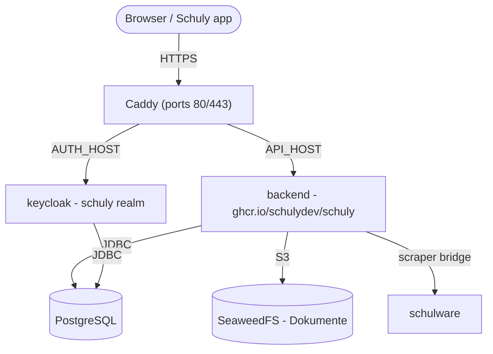

# Self-Hosting

Eine Anleitung von Grund auf, um das Schuly-Backend **und die Dienste, die es
braucht**, auf deinem eigenen Server aufzusetzen - mit den veröffentlichten
GHCR-Images und dem fertigen Stack unter
[`deploy/`](https://github.com/schulydev/SchulyBackend/tree/main/deploy). Alles
läuft hinter [Caddy](https://caddyserver.com/) mit automatischem HTTPS.

Für die lokale Entwicklung siehe stattdessen [Entwicklung](development.md). Für
Details zu Image/Release und die vollständige Liste der Einstellungen siehe
[Produktion](production.md) und [Konfiguration](configuration.md).

## Was du betreiben wirst



| Dienst | Image | Exponiert |
|---|---|---|
| `caddy` | `caddy:2` | **80 / 443** - die einzigen öffentlichen Ports |
| `backend` | `ghcr.io/schulydev/schuly` | über Caddy → `https://${API_HOST}` |
| `keycloak` | `ghcr.io/schulydev/schulykeycloak` | über Caddy → `https://${AUTH_HOST}` |
| `postgres` | `postgres:18.1` | intern (Datenbanken `schuly` und `keycloak`) |
| `seaweedfs` | `chrislusf/seaweedfs` | intern - S3-Dokumenten-Storage |
| `schulware` | `ghcr.io/pianonic/schulwareapi` | intern - Schulnetz-Bridge für das Schulware-Plugin |

Das Backend validiert OIDC-Tokens gegen das Keycloak-Realm `schuly`, wendet
seine EF-Core-Migrationen beim Start automatisch an und lädt die in
`config/plugins.yml` deklarierten Plugins aus der Registry herunter (im Image
sind keine Plugin-DLLs enthalten).

## Voraussetzungen

- Ein Linux-Server mit **Docker** und dem **Compose-Plugin** (`docker
  compose`).
- Die Ports **80** und **443** offen zum Internet.
- Zwei DNS-Einträge, die auf den Server zeigen - einer für die API, einer für
  Keycloak (z. B. `api.schuly.example` und `auth.schuly.example`). Caddy braucht
  sie beim ersten Start auflösbar, damit Let's Encrypt Zertifikate ausstellen
  kann.

## 1. Die Deploy-Dateien holen

Das Repo klonen (oder nur den Ordner `deploy/` kopieren) auf den Server und
hineinwechseln:

```sh
git clone https://github.com/schulydev/SchulyBackend.git
cd SchulyBackend/deploy
```

Alles Folgende läuft aus `deploy/` heraus, das vor jeder Änderung so aussieht:

```
deploy/
├── .env.example
├── Caddyfile
├── compose.staging.yml
├── config/
│   ├── backend.env
│   ├── keycloak.env
│   ├── plugins.yml
│   ├── plugins-config/
│   │   └── Schuly.Plugin.Schulware.yml
│   ├── postgres-init/
│   │   └── 01-create-keycloak-db.sh
│   └── seaweedfs/
│       └── s3-config.json
└── README.md
```

Am Ende dieser Anleitung hast du zusätzlich `.env` (Schritt 3, aus
`.env.example`) und einen Ordner `data/` (automatisch beim ersten `up`
erzeugt, Schritt 5), der alles enthält, was der Stack dauerhaft speichert:

```
deploy/
├── .env                  # ← du erstellst diese Datei
├── ...                   #   (unveränderte Dateien weggelassen)
└── data/                 # ← beim ersten `docker compose up` erstellt
    ├── postgres/
    ├── seaweedfs/
    ├── plugins/           # heruntergeladene Plugin-DLLs
    ├── caddy/              # TLS-Zertifikate/-Status
    └── caddy-config/
```

## 2. DNS auf den Server ausrichten

A/AAAA-Einträge für deine beiden Hostnamen erstellen und warten, bis sie auf
die öffentliche IP des Servers auflösen. Bis dahin schlägt die
Zertifikatsausstellung fehl.

## 3. Secrets konfigurieren

Die Vorlage kopieren und ausfüllen:

```sh
cp .env.example .env
```

| Variable | Was zu setzen ist |
|---|---|
| `API_HOST` | Öffentlicher Hostname für die API, z. B. `api.schuly.example`. |
| `AUTH_HOST` | Öffentlicher Hostname für Keycloak, z. B. `auth.schuly.example`. |
| `SCHULY_VERSION` | Tag des Backend-Images. `latest` folgt jedem Release; eine Version wie `1.3.3` fixieren, um selbst zu entscheiden, wann du wechselst. |
| `KEYCLOAK_VERSION` | Tag des Keycloak-Images, gleiches Prinzip. |
| `POSTGRES_USER` | Datenbankbenutzer (von Backend und Keycloak gemeinsam genutzt). |
| `POSTGRES_PASSWORD` | Ein starkes Datenbankpasswort. |
| `KC_ADMIN_USER` | Bootstrap-Admin-Benutzername für Keycloak (Master-Realm). |
| `KC_ADMIN_PASSWORD` | Bootstrap-Admin-Passwort für Keycloak. |
| `S3_ACCESS_KEY` | S3-Access-Key für SeaweedFS. |
| `S3_SECRET_KEY` | S3-Secret-Key für SeaweedFS. |
| `AVATAR_SIGNING_KEY` | HMAC-Schlüssel zum Signieren von Avatar-URLs (erforderlich). Erzeugen mit `openssl rand -hex 32`. |
| `SMTP_HOST`, `SMTP_PORT`, `SMTP_FROM`, `SMTP_USER`, `SMTP_PASSWORD`, `SMTP_SSL`, `SMTP_STARTTLS` | Optional. Mailserver für das Keycloak-Realm - nötig für verifizierte E-Mails und das selbstständige Zurücksetzen von Passwörtern. |

> Die S3-Zugangsdaten **müssen mit** `config/seaweedfs/s3-config.json`
> übereinstimmen - aktualisiere sowohl die `.env` als auch diese Datei mit
> denselben Werten, sonst authentifiziert sich der Dokumenten-Storage nicht.

> Die `SMTP_*`-Werte werden beim **ersten** Import fest ins Realm übernommen.
> Eine spätere Änderung wirkt sich nicht mehr auf ein bestehendes Realm aus -
> stattdessen **Realm-Einstellungen → E-Mail** in der Keycloak-Admin-Konsole
> bearbeiten. Sie ungesetzt zu lassen ist unproblematisch; das Realm wird dann
> ohne funktionierenden Mailserver importiert.

### Wo die restlichen Einstellungen liegen

`.env` enthält, was sich pro Deployment ändert. Die Einstellungen der beiden
Anwendungen selbst liegen neben den übrigen Konfigurationsdateien und lesen
`${...}`-Werte direkt aus `.env`:

| Datei | Enthält |
|---|---|
| [`config/backend.env`](https://github.com/schulydev/SchulyBackend/blob/main/deploy/config/backend.env) | Backend-Einstellungen - Datenbankverbindung, OIDC, S3, Plugin-Pfade. |
| [`config/keycloak.env`](https://github.com/schulydev/SchulyBackend/blob/main/deploy/config/keycloak.env) | Keycloak-Einstellungen - Datenbank, Hostname, Proxy-Header, Bootstrap-Admin, SMTP. |

Normalerweise fasst du keine der beiden an; sie existieren, damit
`compose.staging.yml` lesbar bleibt als Abbild des Stacks statt als Wand aus
Umgebungsvariablen.

## 4. (Optional) Die Plugins durchsehen

`config/plugins.yml` listet die Plugins, die das Backend beim Start lädt
(standardmässig das Schulware-Plugin), und `config/plugins-config/` enthält
die Konfiguration jedes Plugins. Jedes Plugin **liefert zudem seinen eigenen
Eintrag im School-System-Katalog** - das System, das die App in ihrer Auswahl
zeigt (Schulware liefert `schulnetz`, OdaOrg `odaorg`) - daher fügt die
Installation eines Plugins dessen System automatisch hinzu, ohne
Katalog-Konfiguration. Die Standardwerte funktionieren von Haus aus; passe sie
nur bei Bedarf an.

## 5. Den Stack starten

```sh
docker compose -f compose.staging.yml up -d
docker compose -f compose.staging.yml logs -f backend
```

Beim ersten Start: Postgres legt die Datenbanken `schuly` und `keycloak` an,
Keycloak importiert das Realm `schuly`, das Backend wendet seine Migrationen
an und spielt den School-Systems-Katalog aus den geladenen Plugins ein, und
Caddy bezieht TLS-Zertifikate für beide Hostnamen.

## 6. End-to-End verifizieren

- `https://${AUTH_HOST}` → die Keycloak-Admin-Konsole. Mit `KC_ADMIN_USER` /
  `KC_ADMIN_PASSWORD` im Master-Realm anmelden; das Realm `schuly` sollte
  bereits existieren.
- `https://${API_HOST}/api/app/school-systems` → der anonyme Katalog-Endpunkt,
  der zeigt, dass die API läuft (`/api/app` ist die einzige nicht
  authentifizierte Route).
- `https://${API_HOST}/api/app` → die App-Konfiguration (ebenfalls anonym);
  ihr Feld `version` zeigt die laufende Backend-Version - praktisch, um ein
  Deployment oder Upgrade zu bestätigen.
- `https://${API_HOST}/api/plugins` → geladene Plugins (erfordert ein Login
  mit der Rolle `Administrator`). Zur Laufzeit verwaltbar mit `POST
  /api/plugins/install` und `DELETE /api/plugins/{name}`.
- Die Schuly-App auf `https://${API_HOST}` richten. Ihr Login steuert
  Keycloak über den Client `schuly-app`; da App und Backend beide
  `https://${AUTH_HOST}` als OIDC-Authority verwenden, stimmt der
  Token-Issuer überein und die Validierung gelingt.

## 7. Deinen ersten Login erstellen

Der Bootstrap-Admin (`KC_ADMIN_USER` / `KC_ADMIN_PASSWORD`) meldet sich nur im
**Master-Realm** von Keycloak an - der Admin-Konsole, nicht der Schuly-App
selbst. Um einen Login zu erhalten, der in der App funktioniert, einen
Benutzer im Realm **schuly** anlegen:

1. In der Keycloak-Admin-Konsole den Realm-Selector (oben links) von `master`
   auf `schuly` umstellen.
2. **Users → Add user.** Einen Benutzernamen setzen (und eine E-Mail-Adresse,
   falls SMTP konfiguriert wurde).
3. **Tab Credentials → Set password.** "Temporary" ausschalten, ausser du
   möchtest beim ersten Login zur Passwortänderung aufgefordert werden.
4. **Tab Groups → Join group.** Den Benutzer zu `Student`, `Teacher` oder
   `Administrator` hinzufügen - das Backend liest den Claim `groups` als
   App-Rolle, und nur `Administrator` kann Plugins über die API verwalten.

Dieser Benutzer kann sich nun in der Schuly-App im Private-Modus anmelden -
sie auf `https://${API_HOST}` ausrichten, und sie steuert Keycloak von dort
aus.

## 8. Für den Produktivbetrieb härten

Das mitgelieferte Realm `schuly` bringt einen **Starter**-PKCE-Client
`schuly-app` sowie die Gruppen Student / Teacher / Administrator mit
(abgebildet auf den Claim `groups`, den das Backend als Rollen liest). Vor dem
echten Einsatz:

- Das Starter-Realm durch einen richtigen Export ersetzen und jedes Secret in
  `.env` rotieren.
- Einen echten Keycloak-Admin anlegen und die Bootstrap-Variablen
  `KC_ADMIN_*` entfernen (siehe die Self-Hosting-Doku des
  SchulyKeycloak-Projekts für die Keycloak-spezifischen Schritte).
- Die Management-/internen Dienste unexponiert halten - nur Caddy sollte
  Ports veröffentlichen.

## Ohne öffentliche Domain betreiben (LAN / lokales Testen)

Alles Vorherige geht von einer echten Domain mit DNS aus, das du kontrollierst,
damit Caddy ein Let's-Encrypt-Zertifikat beziehen kann. Wenn du den Stack nur
in deinem eigenen Netzwerk betreiben willst - gegen ein Handy über WLAN testen,
keine Domain, kein TLS - ändern sich ein paar Dinge.

**Keycloak signiert Tokens mit einer festen Issuer-URL (`KC_HOSTNAME`), und
das Backend validiert eingehende Tokens, indem es Metadaten von genau dieser
URL abruft.** Was auch immer du also in `API_HOST`/`AUTH_HOST` einträgst, muss
für den Backend-Container und für alles, was deine App ausführt (Handy,
Browser, Emulator), **identisch** auflösen - landen sie auf unterschiedlichen
Adressen, stimmt der Issuer nicht überein und jeder Login schlägt fehl.

Zwei Wege zu einem stabilen Hostnamen ohne echte Domain:

- **Die LAN-IP deines Rechners, direkt verwendet** - `API_HOST=AUTH_HOST=192.168.1.42`,
  gar kein Hostname. Am einfachsten, und von einem Handy im gleichen WLAN
  erreichbar. Docker Desktop lässt einen Container zuverlässig einen Port
  erreichen, der auf der eigenen LAN-IP des Hosts veröffentlicht ist (eine
  "Hairpin"-Verbindung zurück durch den Host und wieder hinein), sodass das
  Backend Keycloak so weiterhin erreicht, ohne zusätzliche Netzwerk-Verdrahtung
  - in der Praxis bestätigt funktionierend. Nachteil: bricht, wenn sich die IP
  ändert (neuer DHCP-Lease), und ist nur aus diesem Netzwerk erreichbar.
- **Ein Wildcard-DNS-Hostname, der auf deine LAN-IP zeigt**, z. B.
  `<ip>.nip.io` oder `<ip>.sslip.io` - diese lösen öffentlich direkt auf die
  im Namen codierte IP auf. Angenehmer als eine rohe IP, aber **viele
  Consumer-Router blockieren das**: DNS-Rebind-Schutz (standardmässig aktiv
  bei den meisten FritzBox/AVM-Routern, unter anderem) verweigert die
  Auflösung eines öffentlichen Hostnamens, der auf eine private Adresse zeigt,
  sodass der Name für niemanden in diesem Netzwerk auflöst. Wenn Lookups
  rätselhaft ohne brauchbare Fehlermeldung fehlschlagen, ist fast immer das
  der Grund - dann auf die rohe IP zurückfallen.

Bei beiden Varianten kann Caddy die beiden Dienste nicht mehr am Hostnamen
unterscheiden, da `API_HOST` und `AUTH_HOST` jetzt dieselbe Adresse sind -
stattdessen unterschiedliche Ports verwenden.

### Durchgerechnetes Beispiel

Angenommen, die LAN-IP deines Rechners ist `192.168.1.42`. An der Struktur des
Ordners `deploy/` aus Schritt 1 ändert sich nichts - du bearbeitest vier der
bestehenden Dateien an Ort und Stelle, mehr nicht:

```
deploy/
├── .env                  ← aus .env.example erstellen; API_HOST/AUTH_HOST = die LAN-IP
├── Caddyfile              ← bearbeiten: reines HTTP, explizite Ports, kein Routing nach Hostname
├── compose.staging.yml    ← bearbeiten: Ports des caddy-Diensts
├── config/
│   ├── backend.env        ← bearbeiten: RequireHttpsMetadata=false
│   ├── keycloak.env        (unverändert - KC_HTTP_ENABLED ist bereits true)
│   ├── plugins.yml         (unverändert)
│   ├── plugins-config/
│   │   └── Schuly.Plugin.Schulware.yml   (unverändert)
│   ├── postgres-init/
│   │   └── 01-create-keycloak-db.sh      (unverändert)
│   └── seaweedfs/
│       └── s3-config.json                (unverändert)
└── data/                  (beim ersten `up` erstellt, wie im Domain-Fall)
```

**`.env`** - gleiche Vorlage wie in Schritt 3, nur beide Hostnamen auf die
rohe IP setzen und `SMTP_*` für einen schnellen Test auskommentiert lassen:

```sh
API_HOST=192.168.1.42
AUTH_HOST=192.168.1.42
SCHULY_VERSION=latest
KEYCLOAK_VERSION=latest
POSTGRES_USER=schuly
POSTGRES_PASSWORD=change-me-postgres
KC_ADMIN_USER=admin
KC_ADMIN_PASSWORD=change-me-kc-admin
S3_ACCESS_KEY=schuly-access
S3_SECRET_KEY=change-me-s3-secret
AVATAR_SIGNING_KEY=change-me-avatar-signing-key
```

**`Caddyfile`** - die ganze Datei ersetzen (die domainbasierte Version bezieht
pro Hostname ein TLS-Zertifikat; diese hier proxyt nur nach Port):

```
http://{$API_HOST}:8080 {
	reverse_proxy backend:8080
}
http://{$AUTH_HOST}:8081 {
	reverse_proxy keycloak:8080
}
```

**`compose.staging.yml`** - im `caddy`-Dienst die `ports:`-Liste austauschen
(`443:443` weglassen, es gibt kein Zertifikat auszuliefern):

```yaml
  caddy:
    image: caddy:2
    restart: unless-stopped
    ports:
      - "8080:8080"
      - "8081:8081"
    environment:
      API_HOST: ${API_HOST}
      AUTH_HOST: ${AUTH_HOST}
    volumes:
      - ./Caddyfile:/etc/caddy/Caddyfile:ro
      - ./data/caddy:/data
      - ./data/caddy-config:/config
    depends_on:
      - backend
      - keycloak
```

**`config/backend.env`** - eine Zeile ändert sich, von `true` auf `false`:

```
Oidc__RequireHttpsMetadata=false
```

Dann genau wie in Schritt 5 starten:

```sh
docker compose -f compose.staging.yml up -d
docker compose -f compose.staging.yml logs -f backend
```

Und mit denselben Prüfungen wie in Schritt 6 verifizieren, nur mit `http://`
und einem Port statt `https://`:

```sh
curl http://192.168.1.42:8080/api/app/school-systems       # anonymer Katalog
curl http://192.168.1.42:8081/realms/schuly/.well-known/openid-configuration
```

Das Feld `"issuer"` in der Antwort des zweiten Befehls sollte exakt
`http://192.168.1.42:8081/realms/schuly` lauten - stimmt es nicht mit dem
überein, was deine App/dein Browser zum Erreichen von Keycloak verwendet, ist
das die oben beschriebene Diskrepanz, und der Login schlägt fehl.

Alles Übrige - DNS-unabhängige Schritte wie Realm-Import, Plugin-Loading und
der Login-Walkthrough oben - funktioniert genau gleich. Noch etwas
Wissenswertes: Die Windows-Firewall kann beim ersten Mal ein Handy im
gleichen WLAN stillschweigend davon abhalten, diese Ports zu erreichen -
erlaube Docker Desktop im **privaten Netzwerk**, falls danach gefragt wird,
oder füge selbst eine eingehende Regel für die Ports hinzu.

## Betrieb

- **Persistenz** - der gesamte Zustand ist **unter `./data` in
  Host-Ordner gemountet** (keine Named Volumes): `data/postgres`,
  `data/seaweedfs`, `data/plugins`, `data/caddy*`. Das ist das empfohlene
  Setup - deine Daten bleiben auf dem Host sichtbar und lassen sich einfach
  sichern. Die Ordner werden beim ersten `up` erstellt, und ein
  One-Shot-Dienst `init-perms` macht `data/plugins` automatisch für den
  Benutzer des Backends beschreibbar, sodass es beim ersten Lauf einfach
  funktioniert. Zum Zurücksetzen den Stack stoppen und `./data` löschen.
- **Upgrades** - `SCHULY_VERSION` und `KEYCLOAK_VERSION` in `.env` auf eine
  fixe Version statt `latest` setzen, damit sich ein Deployment exakt
  wiederholt und du selbst entscheidest, wann du wechselst. Die Version
  ändern, dann `up -d` zum Vorwärtsrollen. Migrationen laufen automatisch auf
  dem neuen Container; vor grösseren Sprüngen `data/postgres` sichern.
- **Plugin-Änderungen**, die über die API vorgenommen werden, werden in
  `config/plugins.yml` zurückgeschrieben.

## Referenz: das vollständige `compose.staging.yml`

Der Vollständigkeit halber der komplette Stack, den diese Anleitung betreibt
(dieselbe Datei liegt im `deploy/`-Ordner des Repos). Der gesamte Zustand ist
unter `./data` gemountet - keine Named Volumes - und ein One-Shot-Dienst
`init-perms` macht den Plugins-Ordner beim ersten Start für das Backend
beschreibbar, sodass ein einfaches `docker compose up` funktioniert.

```yaml
services:
  # One-Shot: macht den gemounteten Plugins-Ordner für den Non-Root-Benutzer
  # des Backends (uid 1654) beschreibbar, bevor dieses startet, damit ein
  # einfaches `up` beim allerersten Lauf ohne manuelles chown funktioniert.
  # Läuft einmal und beendet sich dann.
  init-perms:
    image: busybox:1.37
    command: sh -c "mkdir -p /data/plugins && chown -R 1654:1654 /data/plugins"
    volumes:
      - ./data:/data
    restart: "no"

  postgres:
    image: postgres:18.1
    restart: unless-stopped
    environment:
      POSTGRES_USER: ${POSTGRES_USER}
      POSTGRES_PASSWORD: ${POSTGRES_PASSWORD}
      POSTGRES_DB: schuly
    # Legt beim ersten Init die zusätzliche Datenbank `keycloak` an (die
    # Plugin-Datenbanken des Backends werden automatisch von den
    # EF-Migrationen erstellt).
    volumes:
      # postgres:18 speichert Daten in einem versionierten Unterordner,
      # daher wird unter /var/lib/postgresql gemountet (nicht
      # /var/lib/postgresql/data, das jetzt abgelehnt wird).
      - ./data/postgres:/var/lib/postgresql
      - ./config/postgres-init:/docker-entrypoint-initdb.d:ro
    healthcheck:
      # -h 127.0.0.1 erzwingt eine TCP-Prüfung. Während der Entrypoint die
      # Init-Skripte ausführt, bedient er nur den Unix-Socket - ein
      # Socket-basierter Check würde also mitten im Init "healthy" melden
      # und Abhängige mit einem Server verbinden lassen, der gleich
      # neu startet.
      test: ["CMD-SHELL", "pg_isready -U ${POSTGRES_USER} -d schuly -h 127.0.0.1"]
      interval: 10s
      timeout: 5s
      retries: 10

  seaweedfs:
    image: chrislusf/seaweedfs:latest
    restart: unless-stopped
    command: >
      server -dir=/data
      -s3 -s3.config=/etc/seaweedfs/s3-config.json -s3.port=8333
      -master.volumeSizeLimitMB=1024
    volumes:
      - ./data/seaweedfs:/data
      - ./config/seaweedfs/s3-config.json:/etc/seaweedfs/s3-config.json:ro

  keycloak:
    image: ghcr.io/schulydev/schulykeycloak:${KEYCLOAK_VERSION:-latest}
    restart: unless-stopped
    env_file: [./config/keycloak.env]
    depends_on:
      postgres:
        condition: service_healthy

  schulware:
    image: ghcr.io/pianonic/schulwareapi:latest
    restart: unless-stopped
    init: true        # Zombie-Prozesse einsammeln
    ipc: host         # Shared-Memory-Spielraum für den Scraper
    environment:
      # Schulnetz-Client-ID + PWA-Host sind als Standardwerte fest im
      # SchulwareAPI-Image hinterlegt, hier ist daher keine
      # Schulnetz-Konfiguration nötig.
      PYTHONUNBUFFERED: "1"

  backend:
    image: ghcr.io/schulydev/schuly:${SCHULY_VERSION:-latest}
    restart: unless-stopped
    env_file: [./config/backend.env]
    volumes:
      - ./data/plugins:/app/plugins                        # heruntergeladene Plugin-DLLs (Host-Ordner)
      - ./config/plugins.yml:/app/plugins.yml              # gewünschter Plugin-Bestand (beschreibbar: Endpunkte schreiben ihn um)
      - ./config/plugins-config:/app/plugins-config:ro     # Konfiguration pro Plugin
    depends_on:
      postgres:
        condition: service_healthy
      init-perms:
        condition: service_completed_successfully

  caddy:
    image: caddy:2
    restart: unless-stopped
    ports:
      - "80:80"
      - "443:443"
    environment:
      API_HOST: ${API_HOST}
      AUTH_HOST: ${AUTH_HOST}
    volumes:
      - ./Caddyfile:/etc/caddy/Caddyfile:ro
      - ./data/caddy:/data
      - ./data/caddy-config:/config
    depends_on:
      - backend
      - keycloak
```
