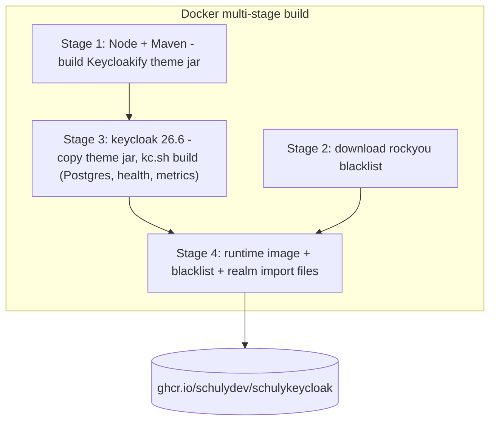
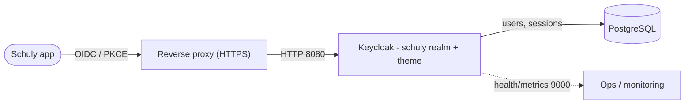

# Architektur

Wie die Teile zusammenspielen und warum das Image so gebaut ist, wie es ist.

## Was im Image steckt

Das Repo erzeugt ein einziges, in sich geschlossenes Keycloak-Image. Drei Bestandteile
werden zur Build-Zeit eingebacken, damit der Produktivcontainer nichts weiter als eine
Datenbank benötigt:

- **Stage 1** kompiliert das `keycloakify/`-Login-Theme zu einem Keycloak-Provider-JAR.
- **Stage 2** lädt die rockyou-Liste geleakter Passwörter herunter.
- **Stage 3** kopiert das Theme-JAR hinein und führt `kc.sh build` aus - ein
  **optimierter** Build, fest auf Postgres eingestellt, mit aktivierten
  Health-/Metrics-Endpunkten, damit der Produktivstart schnell geht.
- **Stage 4** setzt das Runtime-Image zusammen: den optimierten Server, die
  Sperrliste und die Importdateien des `schuly`-Realms.

## Warum ein optimierter Build

`kc.sh build` löst den Datenbank-Vendor und die Feature-Flags im Voraus auf. Die
Runtime startet dann mit `start --optimized` und überspringt den Build-Schritt bei
jedem Boot. Der Kompromiss: Build-Zeit-Einstellungen (insbesondere `KC_DB`) sind im
Image fest verankert - eine Änderung erfordert einen neuen Build. Verbindungsdetails
und der Hostname bleiben Umgebungsvariablen zur Laufzeit. Siehe die
[Konfigurationsreferenz](configuration.md).

## Request-/Login-Ablauf

Die Schuly-App authentifiziert sich über OIDC gegen das `schuly`-Realm (den
öffentlichen Client `schuly-app`, PKCE). Keycloak liefert die gebrandeten
Login-Seiten aus, erzwingt den 2FA-Flow `browser-2fa` und persistiert Nutzer und
Sessions in Postgres. Health- und Metrics-Endpunkte werden getrennt auf Port `9000`
ausschliesslich für internes Monitoring bereitgestellt.

## Source Map

Siehe die Tabelle zur Repository-Struktur im [Dokuindex](README.md) dafür, welche
Datei wofür zuständig ist.
