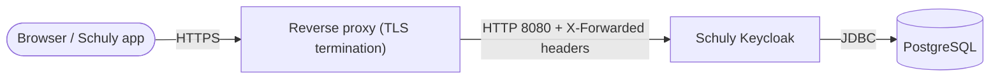

# Self-Hosting

Eine vollständige, copy-paste-fertige Anleitung, um Schuly Keycloak in Produktion zu
betreiben: die Datenbank, das Keycloak-Image und einen TLS-terminierenden Reverse
Proxy - plus die Admin-Einrichtung beim ersten Login. Die vollständige Liste jeder
Einstellung findest du in der [Konfigurationsreferenz](../configuration.md).

## Der Stack



Du brauchst drei Dinge:

1. **PostgreSQL** - Keycloaks Datenspeicher (das Image ist für Postgres gebaut).
2. **Das Schuly-Keycloak-Image** - `ghcr.io/schulydev/schulykeycloak:<tag>`.
3. **Einen Reverse Proxy**, der TLS terminiert und an Keycloak auf `:8080`
   weiterleitet (Caddy, Traefik, nginx - alles, was `X-Forwarded-*`-Header setzt).

## 1. Hostname wählen und Version pinnen

- Entscheide dich für die öffentliche URL, z. B. `https://auth.schuly.dev`, und
  richte deren DNS auf deinen Host.
- Pinne einen Image-Tag statt `:latest`, damit Deployments reproduzierbar sind -
  siehe [Release](release.md) dafür, wie Tags auf Versionen abgebildet werden.

## 2. docker-compose

Das startet Postgres + Keycloak + einen Caddy-Reverse-Proxy (Caddy provisioniert
automatisch ein Let's-Encrypt-Zertifikat und leitet die von Keycloak benötigten
Proxy-Header weiter).

```yaml
services:
  db:
    image: postgres:16
    restart: unless-stopped
    environment:
      POSTGRES_DB: keycloak
      POSTGRES_USER: keycloak
      POSTGRES_PASSWORD: ${DB_PASSWORD:?set DB_PASSWORD}
    volumes:
      - db-data:/var/lib/postgresql/data
    healthcheck:
      test: ["CMD-SHELL", "pg_isready -U keycloak"]
      interval: 10s
      timeout: 5s
      retries: 5

  keycloak:
    image: ghcr.io/schulydev/schulykeycloak:1.4.0   # pin a real tag
    restart: unless-stopped
    depends_on:
      db:
        condition: service_healthy
    environment:
      KC_DB_URL: jdbc:postgresql://db:5432/keycloak
      KC_DB_USERNAME: keycloak
      KC_DB_PASSWORD: ${DB_PASSWORD:?set DB_PASSWORD}
      KC_HOSTNAME: https://auth.schuly.dev
      KC_PROXY_HEADERS: xforwarded
      KC_HTTP_ENABLED: "true"
      # Bootstrap admin - used once, then removed (see step 4).
      KC_BOOTSTRAP_ADMIN_USERNAME: ${BOOTSTRAP_ADMIN_USER:?}
      KC_BOOTSTRAP_ADMIN_PASSWORD: ${BOOTSTRAP_ADMIN_PASSWORD:?}

  proxy:
    image: caddy:2
    restart: unless-stopped
    depends_on: [keycloak]
    ports:
      - "80:80"
      - "443:443"
    volumes:
      - ./Caddyfile:/etc/caddy/Caddyfile
      - caddy-data:/data

volumes:
  db-data:
  caddy-data:
```

`Caddyfile`:

```caddy
auth.schuly.dev {
    reverse_proxy keycloak:8080
}
```

Stelle die Secrets ausserhalb des Compose-Files bereit (z. B. eine `.env`-Datei
daneben, die **nicht** committet wird):

```sh
DB_PASSWORD=change-me-long-random
BOOTSTRAP_ADMIN_USER=bootstrap
BOOTSTRAP_ADMIN_PASSWORD=change-me-too
```

Das sind drei Dateien, so angeordnet:

```
schuly-keycloak/
├── compose.yml     # the docker-compose.yml above
├── Caddyfile        # the Caddyfile above
└── .env             # the secrets above - not committed
```

Hochfahren:

```sh
docker compose up -d
```

> Nur `:8080` wird proxyt. Der Management-Port `:9000` (Health/Metrics) wird
> **nicht** veröffentlicht und darf niemals ins Internet exponiert werden.

## 3. Prüfen, ob alles gesund ist

```sh
# from another container on the same network, or exec into the keycloak container
curl -fsS http://keycloak:9000/health/ready
```

Öffne dann `https://auth.schuly.dev/` - du solltest die gebrandete
Schuly-Login-Seite sehen, und das `schuly`-Realm sollte existieren (es wird beim
ersten Start importiert).

## 4. Einen echten Admin anlegen, den Bootstrap-Admin entfernen

Die `KC_BOOTSTRAP_ADMIN_*`-Zugangsdaten sind ein temporärer, allgemein bekannter
Account. Sobald der Stack läuft:

1. Melde dich in der Admin-Konsole des Master-Realms unter
   `https://auth.schuly.dev/admin/` an.
2. Lege einen neuen Admin-Nutzer mit einem starken Passwort an (Realm **master** →
   Users).
3. Entferne `KC_BOOTSTRAP_ADMIN_USERNAME` / `KC_BOOTSTRAP_ADMIN_PASSWORD` aus der
   Compose-Umgebung und führe erneut `docker compose up -d` aus. Der
   Bootstrap-Account existiert nur, solange diese Variablen beim ersten Start
   gesetzt sind.

> **Sicherheit:** Lass die Bootstrap-Admin-Zugangsdaten niemals in einem
> dauerhaft laufenden Deployment stehen, und committe niemals echte Secrets
> (DB-Passwort, Admin-Passwort) oder platziere sie in `realms/schuly-realm.json`.
> Setze `KC_HOSTNAME` immer auf deine echte HTTPS-URL und terminiere TLS am Proxy.

## 5. Upgrades

Um auf ein neueres Image zu wechseln, ändere den gepinnten Tag und führe
`docker compose up -d` aus. Realm- und Nutzerdaten liegen in Postgres und bleiben
über Image-Upgrades hinweg erhalten; ein bereits importiertes Realm bleibt
unverändert (die mitgelieferte Realm-Datei befüllt nur eine brandneue Datenbank).
Sichere das Postgres-Volume vor grösseren Keycloak-Versionssprüngen.

## Ohne öffentliche Domain betreiben (LAN / lokales Testen)

Alles oben Beschriebene setzt eine echte Domain mit DNS voraus, das du
kontrollierst. Vielleicht hast du keine - zum Beispiel, wenn du gegen ein lokal
laufendes Backend entwickelst (gemäss
[SchulyBackends Entwicklungsanleitung](https://docs.schuly.dev/de/SchulyBackend/setup/development))
und einfach ein echtes, aus dem veröffentlichten Image laufendes Keycloak in
deinem Netzwerk erreichbar brauchst - ohne Domain, ohne TLS. (Das `compose.dev.yml`
aus `setup/development.md` ist etwas anderes - es baut das Image für die
Theme-Arbeit aus dem Quellcode; hier geht es darum, das Produktiv-Image ohne
Domain zu betreiben.)

**`KC_HOSTNAME` ist die URL, auf die der Issuer jedes Tokens gesetzt wird**, und
alles, was diese Tokens validiert (ein Backend, ein Browser, ein Smartphone), muss
Keycloak unter genau dieser URL erreichen - ein blosses `localhost` funktioniert nur,
wenn alles auf derselben Maschine läuft. Die vollständige Erklärung, einschliesslich
warum ein Wildcard-DNS-Hostname wie `<ip>.nip.io` an vielen Heimroutern (wegen
DNS-Rebind-Schutz) oft stillschweigend nicht auflöst und eine rohe LAN-IP der
verlässlichere Fallback ist, findest du in
[SchulyBackends Self-Hosting-Anleitung](https://docs.schuly.dev/de/SchulyBackend/setup/self-hosting#running-without-a-public-domain-lan-local-testing).

Hast du dich für einen Hostnamen entschieden (sagen wir die LAN-IP deiner Maschine,
`192.168.1.42`), ändern sich drei Dinge gegenüber Schritt 2:

```yaml
# compose.yml - keycloak service
environment:
  KC_HOSTNAME: http://192.168.1.42:8080   # was https://auth.schuly.dev

# proxy (caddy) service
ports:
  - "8080:8080"   # was "80:80" / "443:443" - no cert to serve, so no 443
```

```
# Caddyfile - plain HTTP, explicit port, no ACME
http://192.168.1.42:8080 {
	reverse_proxy keycloak:8080
}
```

Alles Weitere - Realm-Import, der Bootstrap-Admin-Schritt, die Verifizierung -
bleibt unverändert, nur `http://` statt `https://`. Was auch immer sonst noch
Tokens von diesem Keycloak validieren wird (z. B. ein selbst gehostetes
SchulyBackend), muss ebenfalls seine HTTPS-Metadaten-Anforderung lockern - siehe
die Dokumentation dieses Projekts.

## Nächste Schritte

- [Konfigurationsreferenz](../configuration.md) - jeder Port, jede Variable und jeder Default.
- [Realm-Verwaltung](../realm-management.md) - das `schuly`-Realm bearbeiten und sichern.
- [Fehlerbehebung](../troubleshooting.md) - wenn etwas nicht hochkommt.
