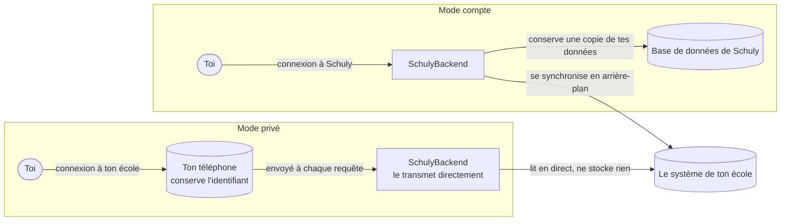

# Modes de l'app

Schuly fonctionne selon l'un des deux modes, choisi au niveau du gate. Les deux
lisent les mêmes systèmes scolaires depuis le même catalogue backend ; ce qui diffère,
c'est **qui authentifie l'utilisateur** et **où finissent les données**. Aucun système
scolaire n'est codé en dur dans l'app - chacun d'eux provient du catalogue.

Les deux modes finissent par lire le même système scolaire. Ce qui change, c'est où ton
identifiant de connexion est conservé et si une partie des données finit par résider
sur un serveur.

## Ce que fait le mode privé sur l'appareil

- L'identifiant de connexion à l'école est écrit dans le **trousseau (keystore) de
  l'appareil** et n'en sort jamais, si ce n'est pour être envoyé au système scolaire
  via les points d'entrée proxy anonymes du backend.
- L'écran de connexion est générique : il affiche les champs de connexion listés par
  le catalogue pour ton école, et suit la `privateAuthStrategy` qu'il déclare -
  `token` (une connexion headless génère un jeton bearer et une session
  renouvelable) ou `scrape` (les identifiants sont rejoués à chaque récupération de
  données).
- Si ton école utilise un code à usage unique, sa graine (seed) est mise sous coffre
  avec le reste, et l'écran **Authenticator** génère les codes directement sur
  l'appareil.
- Quand une session expire, l'app se reconnecte silencieusement depuis le trousseau,
  donc tu n'as pas à te reconnecter manuellement.

|                     | Mode compte                     | Mode privé / sécurisé                                |
| ------------------- | -------------------------------- | ------------------------------------------------------ |
| Authentification à Schuly | OIDC (Keycloak) bearer     | **aucune**                                             |
| Client HTTP         | `ApiClient` (intercepteur auth)  | `Dio` brut, uniquement des points d'entrée anonymes    |
| Où résident les données | côté serveur, dans Postgres  | **uniquement sur l'appareil**                          |
| Rôle du backend     | stocke + synchronise en arrière-plan | proxy sans état en direct, ne stocke rien           |
| Sélection du provider | par compte connecté            | `privateAuthStrategy` du catalogue (`token` / `scrape`) |
