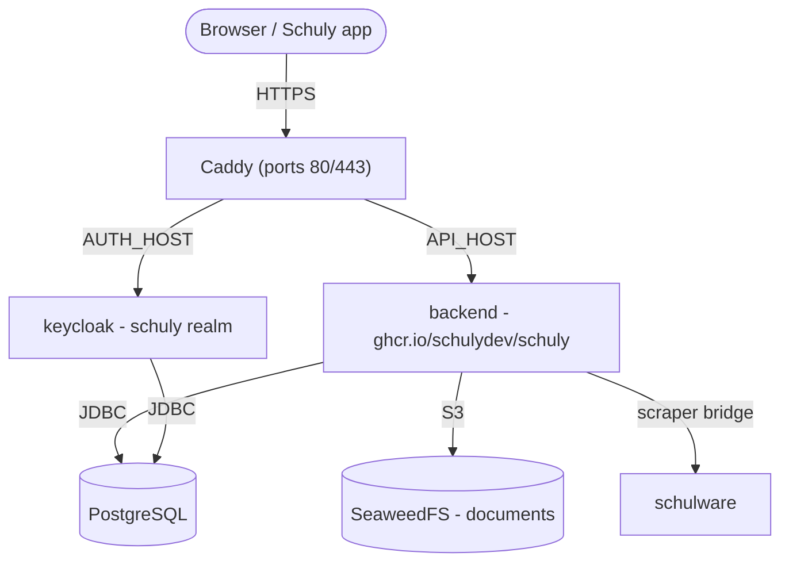

# Auto-hébergement

Un guide pas à pas partant de zéro pour mettre en place le backend Schuly **et les
services dont il a besoin** sur ton propre serveur, en utilisant les images GHCR
publiées et la pile prête à l'emploi sous
[`deploy/`](https://github.com/schulydev/SchulyBackend/tree/main/deploy). Tout
s'exécute derrière [Caddy](https://caddyserver.com/) avec HTTPS automatique.

Pour le développement local, voir plutôt [Développement](development.md). Pour les
détails d'image/release et la liste complète des paramètres, voir
[Production](production.md) et [Configuration](configuration.md).

## Ce que tu vas faire tourner



| Service | Image | Exposition |
|---|---|---|
| `caddy` | `caddy:2` | **80 / 443** - les seuls ports publics |
| `backend` | `ghcr.io/schulydev/schuly` | via Caddy → `https://${API_HOST}` |
| `keycloak` | `ghcr.io/schulydev/schulykeycloak` | via Caddy → `https://${AUTH_HOST}` |
| `postgres` | `postgres:18.1` | interne (bases de données `schuly` et `keycloak`) |
| `seaweedfs` | `chrislusf/seaweedfs` | interne - stockage de documents S3 |
| `schulware` | `ghcr.io/pianonic/schulwareapi` | interne - pont Schulnetz pour le plugin Schulware |

Le backend valide les jetons OIDC par rapport au realm Keycloak `schuly`, applique ses
migrations EF Core automatiquement au démarrage, et télécharge les plugins déclarés
dans `config/plugins.yml` depuis le registre (aucune DLL de plugin n'est intégrée
dans l'image).

## Prérequis

- Un serveur Linux avec **Docker** et le **plugin Compose** (`docker compose`).
- Les ports **80** et **443** ouverts vers internet.
- Deux enregistrements DNS pointant vers le serveur - un pour l'API, un pour Keycloak
  (par ex. `api.schuly.example` et `auth.schuly.example`). Caddy a besoin qu'ils
  soient résolvables avant le premier démarrage pour que Let's Encrypt puisse émettre
  les certificats.

## 1. Récupérer les fichiers de déploiement

Clone le dépôt (ou copie uniquement son dossier `deploy/`) sur le serveur et
entres-y :

```sh
git clone https://github.com/schulydev/SchulyBackend.git
cd SchulyBackend/deploy
```

Tout ce qui suit s'exécute depuis `deploy/`, qui ressemble à ceci avant que tu n'y
touches :

```
deploy/
├── .env.example
├── Caddyfile
├── compose.staging.yml
├── config/
│   ├── backend.env
│   ├── keycloak.env
│   ├── plugins.yml
│   ├── plugins-config/
│   │   └── Schuly.Plugin.Schulware.yml
│   ├── postgres-init/
│   │   └── 01-create-keycloak-db.sh
│   └── seaweedfs/
│       └── s3-config.json
└── README.md
```

À la fin de ce guide, tu auras aussi `.env` (étape 3, créé depuis `.env.example`) et un
dossier `data/` (créé automatiquement au premier `up`, étape 5) contenant tout ce que
la pile persiste :

```
deploy/
├── .env                  # ← tu crées ce fichier
├── ...                   #   (fichiers inchangés omis)
└── data/                 # ← créé au premier `docker compose up`
    ├── postgres/
    ├── seaweedfs/
    ├── plugins/           # DLL de plugins téléchargées
    ├── caddy/              # certificats/état TLS
    └── caddy-config/
```

## 2. Pointer le DNS vers le serveur

Crée des enregistrements A/AAAA pour tes deux noms d'hôte et attends qu'ils résolvent
vers l'IP publique du serveur. Tant que ce n'est pas le cas, l'émission du certificat
échouera.

## 3. Configurer les secrets

Copie le modèle et complète-le :

```sh
cp .env.example .env
```

| Variable | Que définir |
|---|---|
| `API_HOST` | Nom d'hôte public pour l'API, par ex. `api.schuly.example`. |
| `AUTH_HOST` | Nom d'hôte public pour Keycloak, par ex. `auth.schuly.example`. |
| `SCHULY_VERSION` | Tag de l'image backend. `latest` suit chaque release ; fixe une version comme `1.3.3` pour décider toi-même quand évoluer. |
| `KEYCLOAK_VERSION` | Tag de l'image Keycloak, même principe. |
| `POSTGRES_USER` | Utilisateur de la base de données (partagé par le backend et Keycloak). |
| `POSTGRES_PASSWORD` | Un mot de passe de base de données robuste. |
| `KC_ADMIN_USER` | Nom d'utilisateur admin d'amorçage de Keycloak (realm master). |
| `KC_ADMIN_PASSWORD` | Mot de passe admin d'amorçage de Keycloak. |
| `S3_ACCESS_KEY` | Clé d'accès S3 de SeaweedFS. |
| `S3_SECRET_KEY` | Clé secrète S3 de SeaweedFS. |
| `AVATAR_SIGNING_KEY` | Clé HMAC pour signer les URL d'avatar (requise). Génère-la avec `openssl rand -hex 32`. |
| `SMTP_HOST`, `SMTP_PORT`, `SMTP_FROM`, `SMTP_USER`, `SMTP_PASSWORD`, `SMTP_SSL`, `SMTP_STARTTLS` | Optionnel. Serveur mail pour le realm Keycloak - nécessaire pour les emails vérifiés et la réinitialisation autonome du mot de passe. |

> Les identifiants S3 **doivent correspondre** à `config/seaweedfs/s3-config.json` -
> mets à jour à la fois le `.env` et ce fichier avec les mêmes valeurs, sinon le
> stockage de documents ne s'authentifiera pas.

> Les valeurs `SMTP_*` sont intégrées au realm lors de son **premier** import. Les
> modifier plus tard n'a aucun effet sur un realm existant - modifie plutôt
> **Realm settings → Email** dans la console d'administration Keycloak. Les laisser
> non définies fonctionne aussi ; le realm s'importe alors sans serveur mail
> opérationnel.

### Où vivent les autres paramètres

`.env` contient ce qui change à chaque déploiement. Les paramètres propres aux deux
applications se trouvent à côté des autres fichiers de configuration, et lisent les
valeurs `${...}` directement depuis `.env` :

| Fichier | Contient |
|---|---|
| [`config/backend.env`](https://github.com/schulydev/SchulyBackend/blob/main/deploy/config/backend.env) | Paramètres du backend - connexion à la base de données, OIDC, S3, chemins des plugins. |
| [`config/keycloak.env`](https://github.com/schulydev/SchulyBackend/blob/main/deploy/config/keycloak.env) | Paramètres de Keycloak - base de données, nom d'hôte, en-têtes de proxy, admin d'amorçage, SMTP. |

En temps normal tu ne touches à aucun des deux ; ils existent pour que
`compose.staging.yml` reste lisible comme une vue d'ensemble de la pile plutôt qu'un
mur de variables d'environnement.

## 4. (Optionnel) Vérifier les plugins

`config/plugins.yml` liste les plugins que le backend charge au démarrage (le plugin
Schulware par défaut), et `config/plugins-config/` contient la configuration de
chaque plugin. Chaque plugin **fournit aussi sa propre entrée de catalogue de système
scolaire** - le système que l'application affiche dans son sélecteur (Schulware
apporte `schulnetz`, OdaOrg apporte `odaorg`) - donc installer un plugin ajoute
automatiquement son système, sans aucune configuration de catalogue. Les valeurs par
défaut fonctionnent telles quelles ; n'ajuste que si nécessaire.

## 5. Démarrer la pile

```sh
docker compose -f compose.staging.yml up -d
docker compose -f compose.staging.yml logs -f backend
```

Au premier démarrage : Postgres crée les bases de données `schuly` et `keycloak`,
Keycloak importe le realm `schuly`, le backend applique ses migrations et alimente le
catalogue des systèmes scolaires à partir des plugins chargés, et Caddy obtient les
certificats TLS pour les deux noms d'hôte.

## 6. Vérifier de bout en bout

- `https://${AUTH_HOST}` → la console d'administration Keycloak. Connecte-toi au
  realm master avec `KC_ADMIN_USER` / `KC_ADMIN_PASSWORD` ; le realm `schuly` devrait
  déjà exister.
- `https://${API_HOST}/api/app/school-systems` → l'endpoint de catalogue anonyme,
  prouvant que l'API est en ligne (`/api/app` est la seule route non authentifiée).
- `https://${API_HOST}/api/app` → la configuration de l'application (également
  anonyme) ; son champ `version` indique la version du backend en cours d'exécution -
  pratique pour confirmer un déploiement ou une mise à niveau.
- `https://${API_HOST}/api/plugins` → les plugins chargés (nécessite une connexion
  `Administrator`). Gère-les à l'exécution avec `POST /api/plugins/install` et
  `DELETE /api/plugins/{name}`.
- Pointe l'application Schuly vers `https://${API_HOST}`. Sa connexion passe par
  Keycloak via le client `schuly-app` ; comme l'application et le backend utilisent
  tous deux `https://${AUTH_HOST}` comme autorité OIDC, l'émetteur du jeton
  correspond et la validation passe.

## 7. Créer ta première connexion

L'admin d'amorçage (`KC_ADMIN_USER` / `KC_ADMIN_PASSWORD`) se connecte uniquement au
**realm master** de Keycloak - la console d'administration, pas l'application Schuly
elle-même. Pour obtenir une connexion qui fonctionne dans l'application, crée un
utilisateur dans le realm **schuly** :

1. Dans la console d'administration Keycloak, bascule le sélecteur de realm (en haut à
   gauche) de `master` vers `schuly`.
2. **Users → Add user.** Définis un nom d'utilisateur (et un email, si tu as
   configuré SMTP).
3. **Onglet Credentials → Set password.** Désactive « Temporary » sauf si tu veux
   être invité à le changer à la première connexion.
4. **Onglet Groups → Join group.** Ajoute l'utilisateur à `Student`, `Teacher` ou
   `Administrator` - le backend lit le claim `groups` comme rôle applicatif, et seul
   `Administrator` peut gérer les plugins via l'API.

Cet utilisateur peut désormais se connecter depuis l'application Schuly en mode privé -
pointe-la vers `https://${API_HOST}` et elle pilote Keycloak depuis là.

## 8. Durcir pour la production

Le realm `schuly` fourni est livré avec un client PKCE `schuly-app` de **démarrage**
et les groupes Student / Teacher / Administrator (mappés au claim `groups` que le
backend lit comme rôles). Avant une utilisation réelle :

- Remplace le realm de démarrage par un export approprié, et fais tourner chaque
  secret dans `.env`.
- Crée un véritable admin Keycloak et retire les variables d'amorçage `KC_ADMIN_*`
  (voir la documentation d'auto-hébergement du projet SchulyKeycloak pour les étapes
  spécifiques à Keycloak).
- Garde les services de gestion/internes non exposés - seul Caddy devrait publier des
  ports.

## Fonctionner sans domaine public (LAN / test local)

Tout ce qui précède suppose un vrai domaine avec un DNS que tu contrôles, pour que
Caddy puisse obtenir un certificat Let's Encrypt. Si tu veux simplement faire tourner
la pile sur ton propre réseau - tester avec un téléphone en Wi-Fi, sans domaine, sans
TLS - quelques éléments changent.

**Keycloak signe les jetons avec une URL d'émetteur fixe (`KC_HOSTNAME`), et le
backend valide les jetons entrants en récupérant les métadonnées depuis cette URL
exacte.** Donc, quelle que soit la valeur que tu mets dans `API_HOST`/`AUTH_HOST`,
elle doit résoudre **de façon identique** pour le conteneur backend et pour ce qui
fait tourner ton application (téléphone, navigateur, émulateur) - si elles
aboutissent à des adresses différentes, l'émetteur ne correspondra pas et chaque
connexion échouera.

Deux façons d'obtenir un nom d'hôte stable sans domaine réel :

- **L'IP LAN de ta machine, utilisée directement** - `API_HOST=AUTH_HOST=192.168.1.42`,
  aucun nom d'hôte du tout. Le plus simple, et accessible depuis un téléphone sur le
  même Wi-Fi. Docker Desktop permet de façon fiable à un conteneur d'atteindre un port
  publié sur la propre IP LAN de l'hôte (une connexion « hairpin » qui repasse par
  l'hôte et revient), donc le backend peut ainsi toujours atteindre Keycloak sans
  câblage réseau supplémentaire - confirmé fonctionnel en pratique. Inconvénient :
  cela casse si l'IP change (nouveau bail DHCP), et ce n'est accessible que depuis ce
  réseau.
- **Un nom d'hôte DNS générique (wildcard) pointant vers ton IP LAN**, par ex.
  `<ip>.nip.io` ou `<ip>.sslip.io` - ceux-ci résolvent publiquement directement vers
  l'IP encodée dans le nom. Plus agréable qu'une IP brute, mais **beaucoup de routeurs
  grand public le bloquent** : la protection DNS-rebind (activée par défaut sur la
  plupart des routeurs FritzBox/AVM, entre autres) refuse de résoudre un nom d'hôte
  public qui pointe vers une adresse privée, donc le nom ne résoudra pour personne sur
  ce réseau. Si les résolutions échouent mystérieusement sans erreur utile, c'est
  presque toujours la raison - reviens à l'IP brute à la place.

Avec l'une ou l'autre option, comme `API_HOST` et `AUTH_HOST` sont désormais la même
adresse, Caddy ne peut plus distinguer les deux services par nom d'hôte - utilise des
ports distincts à la place.

### Exemple concret

Disons que l'IP LAN de ta machine est `192.168.1.42`. Rien ne change dans la structure
du dossier `deploy/` de l'étape 1 - tu modifies simplement quatre des fichiers
existants sur place, rien de plus :

```
deploy/
├── .env                  ← à créer depuis .env.example ; API_HOST/AUTH_HOST = l'IP LAN
├── Caddyfile              ← à modifier : HTTP simple, ports explicites, pas de routage par nom d'hôte
├── compose.staging.yml    ← à modifier : ports du service caddy
├── config/
│   ├── backend.env        ← à modifier : RequireHttpsMetadata=false
│   ├── keycloak.env        (inchangé - KC_HTTP_ENABLED est déjà à true)
│   ├── plugins.yml         (inchangé)
│   ├── plugins-config/
│   │   └── Schuly.Plugin.Schulware.yml   (inchangé)
│   ├── postgres-init/
│   │   └── 01-create-keycloak-db.sh      (inchangé)
│   └── seaweedfs/
│       └── s3-config.json                (inchangé)
└── data/                  (créé au premier `up`, comme dans le cas avec domaine)
```

**`.env`** - même modèle qu'à l'étape 3, il suffit de pointer les deux noms d'hôte
vers l'IP brute et de laisser `SMTP_*` en commentaire pour un test rapide :

```sh
API_HOST=192.168.1.42
AUTH_HOST=192.168.1.42
SCHULY_VERSION=latest
KEYCLOAK_VERSION=latest
POSTGRES_USER=schuly
POSTGRES_PASSWORD=change-me-postgres
KC_ADMIN_USER=admin
KC_ADMIN_PASSWORD=change-me-kc-admin
S3_ACCESS_KEY=schuly-access
S3_SECRET_KEY=change-me-s3-secret
AVATAR_SIGNING_KEY=change-me-avatar-signing-key
```

**`Caddyfile`** - remplace le fichier entier (la version basée sur un domaine obtient
un certificat TLS par nom d'hôte ; celle-ci fait simplement un proxy par port) :

```
http://{$API_HOST}:8080 {
	reverse_proxy backend:8080
}
http://{$AUTH_HOST}:8081 {
	reverse_proxy keycloak:8080
}
```

**`compose.staging.yml`** - dans le service `caddy`, remplace la liste `ports:`
(retire `443:443`, il n'y a aucun certificat à servir) :

```yaml
  caddy:
    image: caddy:2
    restart: unless-stopped
    ports:
      - "8080:8080"
      - "8081:8081"
    environment:
      API_HOST: ${API_HOST}
      AUTH_HOST: ${AUTH_HOST}
    volumes:
      - ./Caddyfile:/etc/caddy/Caddyfile:ro
      - ./data/caddy:/data
      - ./data/caddy-config:/config
    depends_on:
      - backend
      - keycloak
```

**`config/backend.env`** - une seule ligne change, de `true` à `false` :

```
Oidc__RequireHttpsMetadata=false
```

Puis démarre exactement comme à l'étape 5 :

```sh
docker compose -f compose.staging.yml up -d
docker compose -f compose.staging.yml logs -f backend
```

Et vérifie avec les mêmes contrôles qu'à l'étape 6, simplement en `http://` et avec un
port plutôt qu'en `https://` :

```sh
curl http://192.168.1.42:8080/api/app/school-systems       # catalogue anonyme
curl http://192.168.1.42:8081/realms/schuly/.well-known/openid-configuration
```

Le champ `"issuer"` de la réponse à la seconde commande devrait afficher exactement
`http://192.168.1.42:8081/realms/schuly` - si ce n'est pas le cas, il y a le
décalage décrit ci-dessus, et la connexion échouera.

Tout le reste - les étapes indépendantes du DNS comme l'import du realm, le
chargement des plugins, et le parcours de première connexion ci-dessus - fonctionne
exactement de la même façon. Encore une chose utile à savoir : le pare-feu Windows
peut silencieusement bloquer un téléphone sur le même Wi-Fi qui essaie d'atteindre ces
ports la première fois - autorise Docker Desktop sur le **réseau privé** si demandé,
ou ajoute toi-même une règle entrante pour les ports.

## Exploitation

- **Persistance** - tout l'état est **monté en bind sur des dossiers hôtes sous
  `./data`** (pas de volumes nommés) : `data/postgres`, `data/seaweedfs`,
  `data/plugins`, `data/caddy*`. C'est la configuration recommandée - tes données
  restent visibles et faciles à sauvegarder sur l'hôte. Les dossiers sont créés au
  premier `up`, et un service `init-perms` à usage unique rend `data/plugins`
  inscriptible par l'utilisateur du backend automatiquement, donc ça fonctionne
  directement dès le premier lancement. Pour tout effacer, arrête la pile et supprime
  `./data`.
- **Mises à niveau** - fixe `SCHULY_VERSION` et `KEYCLOAK_VERSION` dans `.env` à une
  version précise plutôt qu'à `latest`, pour qu'un déploiement se répète exactement et
  que tu choisisses toi-même quand évoluer. Change la version, puis `up -d` pour
  avancer. Les migrations s'exécutent automatiquement sur le nouveau conteneur ;
  sauvegarde `data/postgres` avant les montées de version majeures.
- **Changements de plugins** effectués via l'API sont persistés dans
  `config/plugins.yml`.

## Référence : le `compose.staging.yml` complet

Pour référence, voici la pile complète que ce guide fait tourner (le même fichier vit
dans le dossier `deploy/` du dépôt). Tout l'état est monté en bind sous `./data` - pas
de volumes nommés - et un service `init-perms` à usage unique rend le dossier des
plugins inscriptible par le backend au premier démarrage, donc un simple
`docker compose up` fonctionne directement.

```yaml
services:
  # Usage unique : rend le dossier de plugins monté en bind inscriptible par
  # l'utilisateur non-root du backend (uid 1654) avant son démarrage, pour qu'un
  # simple `up` fonctionne dès le tout premier lancement sans chown manuel.
  # S'exécute une fois puis se termine.
  init-perms:
    image: busybox:1.37
    command: sh -c "mkdir -p /data/plugins && chown -R 1654:1654 /data/plugins"
    volumes:
      - ./data:/data
    restart: "no"

  postgres:
    image: postgres:18.1
    restart: unless-stopped
    environment:
      POSTGRES_USER: ${POSTGRES_USER}
      POSTGRES_PASSWORD: ${POSTGRES_PASSWORD}
      POSTGRES_DB: schuly
    # Crée la base de données `keycloak` supplémentaire à la première initialisation
    # (les bases de données de plugins du backend sont créées automatiquement par les
    # migrations EF).
    volumes:
      # postgres:18 stocke les données dans un sous-dossier versionné, donc les
      # données se montent sur /var/lib/postgresql (pas /var/lib/postgresql/data,
      # que la version actuelle rejette).
      - ./data/postgres:/var/lib/postgresql
      - ./config/postgres-init:/docker-entrypoint-initdb.d:ro
    healthcheck:
      # -h 127.0.0.1 force un contrôle TCP. Pendant que l'entrypoint exécute les
      # scripts d'initialisation, il ne sert que sur le socket Unix, donc un contrôle
      # basé sur le socket signalerait un état sain en pleine initialisation et
      # laisserait les dépendants se connecter à un serveur sur le point de
      # redémarrer.
      test: ["CMD-SHELL", "pg_isready -U ${POSTGRES_USER} -d schuly -h 127.0.0.1"]
      interval: 10s
      timeout: 5s
      retries: 10

  seaweedfs:
    image: chrislusf/seaweedfs:latest
    restart: unless-stopped
    command: >
      server -dir=/data
      -s3 -s3.config=/etc/seaweedfs/s3-config.json -s3.port=8333
      -master.volumeSizeLimitMB=1024
    volumes:
      - ./data/seaweedfs:/data
      - ./config/seaweedfs/s3-config.json:/etc/seaweedfs/s3-config.json:ro

  keycloak:
    image: ghcr.io/schulydev/schulykeycloak:${KEYCLOAK_VERSION:-latest}
    restart: unless-stopped
    env_file: [./config/keycloak.env]
    depends_on:
      postgres:
        condition: service_healthy

  schulware:
    image: ghcr.io/pianonic/schulwareapi:latest
    restart: unless-stopped
    init: true        # nettoie les processus zombies
    ipc: host         # marge de mémoire partagée pour le scraper
    environment:
      # L'identifiant client Schulnetz + l'hôte PWA sont intégrés par défaut dans
      # l'image SchulwareAPI, donc aucune configuration Schulnetz n'est nécessaire
      # ici.
      PYTHONUNBUFFERED: "1"

  backend:
    image: ghcr.io/schulydev/schuly:${SCHULY_VERSION:-latest}
    restart: unless-stopped
    env_file: [./config/backend.env]
    volumes:
      - ./data/plugins:/app/plugins                        # DLL de plugins téléchargées (dossier hôte)
      - ./config/plugins.yml:/app/plugins.yml              # ensemble désiré de plugins (inscriptible : les endpoints le réécrivent)
      - ./config/plugins-config:/app/plugins-config:ro     # configuration par plugin
    depends_on:
      postgres:
        condition: service_healthy
      init-perms:
        condition: service_completed_successfully

  caddy:
    image: caddy:2
    restart: unless-stopped
    ports:
      - "80:80"
      - "443:443"
    environment:
      API_HOST: ${API_HOST}
      AUTH_HOST: ${AUTH_HOST}
    volumes:
      - ./Caddyfile:/etc/caddy/Caddyfile:ro
      - ./data/caddy:/data
      - ./data/caddy-config:/config
    depends_on:
      - backend
      - keycloak
```
