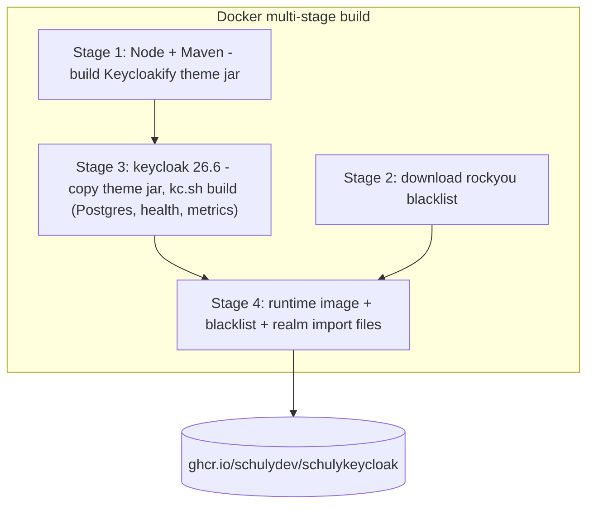
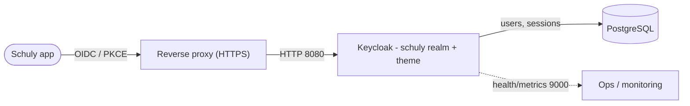

# Architecture

Comment les pièces s'assemblent, et pourquoi l'image est construite ainsi.

## Ce que contient l'image

Le dépôt produit une image Keycloak unique et autonome. Trois éléments sont intégrés
au moment du build pour que le conteneur de production n'ait besoin de rien d'autre
qu'une base de données :

- **L'étape 1** compile le thème de connexion `keycloakify/` en un provider jar Keycloak.
- **L'étape 2** télécharge la liste rockyou des mots de passe compromis.
- **L'étape 3** copie le jar du thème puis exécute `kc.sh build` - un build
  **optimisé**, figé sur Postgres, avec health check et métriques activés, pour un
  démarrage rapide en production.
- **L'étape 4** assemble l'image d'exécution : le serveur optimisé, la liste noire
  et les fichiers d'import du realm `schuly`.

## Pourquoi un build optimisé

`kc.sh build` résout à l'avance le fournisseur de base de données et les feature
flags. L'exécution démarre ensuite avec `start --optimized`, ce qui évite l'étape de
build à chaque démarrage. Le compromis : les réglages fixés au moment du build
(notamment `KC_DB`) sont figés dans l'image - les changer implique de reconstruire
l'image. Les détails de connexion et le nom d'hôte restent des variables
d'environnement définies à l'exécution. Voir la
[référence de configuration](configuration.md).

## Flux de requête / connexion

L'application Schuly s'authentifie auprès du realm `schuly` via OIDC (le client
public `schuly-app`, avec PKCE). Keycloak sert les pages de connexion aux couleurs
de Schuly, applique le flux 2FA `browser-2fa`, et enregistre les utilisateurs et les
sessions dans Postgres. Le health check et les métriques sont exposés séparément sur
le port `9000`, réservé au monitoring interne.

## Carte des sources

Consulte le tableau de structure du dépôt dans l'[index de la documentation](README.md)
pour savoir quel fichier fait quoi.
