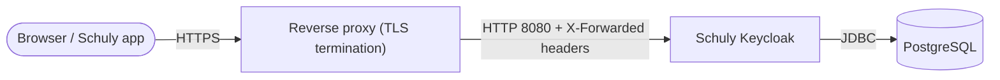

# Auto-hébergement

Un guide complet et prêt à copier-coller pour exécuter Schuly Keycloak en
production : la base de données, l'image Keycloak et un reverse proxy qui termine
le TLS - plus la configuration de l'admin à la première connexion. Pour la liste
exhaustive de chaque réglage, voir la
[référence de configuration](../configuration.md).

## La stack



Il te faut trois choses :

1. **PostgreSQL** - le magasin de données de Keycloak (l'image est construite pour
   Postgres).
2. **L'image Schuly Keycloak** - `ghcr.io/schulydev/schulykeycloak:<tag>`.
3. **Un reverse proxy** qui termine le TLS et redirige vers Keycloak sur `:8080`
   (Caddy, Traefik, nginx - n'importe quoi qui définit les en-têtes
   `X-Forwarded-*`).

## 1. Choisir un nom d'hôte et figer une version

- Décide de l'URL publique, par ex. `https://auth.schuly.dev`, et pointe son DNS
  vers ton hôte.
- Fige un tag d'image plutôt que `:latest` pour que les déploiements soient
  reproductibles - voir [Release](release.md) pour savoir comment les tags
  correspondent aux versions.

## 2. docker-compose

Cela lance Postgres + Keycloak + un reverse proxy Caddy (Caddy provisionne
automatiquement un certificat Let's Encrypt et transmet les en-têtes de proxy dont
Keycloak a besoin).

```yaml
services:
  db:
    image: postgres:16
    restart: unless-stopped
    environment:
      POSTGRES_DB: keycloak
      POSTGRES_USER: keycloak
      POSTGRES_PASSWORD: ${DB_PASSWORD:?set DB_PASSWORD}
    volumes:
      - db-data:/var/lib/postgresql/data
    healthcheck:
      test: ["CMD-SHELL", "pg_isready -U keycloak"]
      interval: 10s
      timeout: 5s
      retries: 5

  keycloak:
    image: ghcr.io/schulydev/schulykeycloak:1.4.0   # pin a real tag
    restart: unless-stopped
    depends_on:
      db:
        condition: service_healthy
    environment:
      KC_DB_URL: jdbc:postgresql://db:5432/keycloak
      KC_DB_USERNAME: keycloak
      KC_DB_PASSWORD: ${DB_PASSWORD:?set DB_PASSWORD}
      KC_HOSTNAME: https://auth.schuly.dev
      KC_PROXY_HEADERS: xforwarded
      KC_HTTP_ENABLED: "true"
      # Bootstrap admin - used once, then removed (see step 4).
      KC_BOOTSTRAP_ADMIN_USERNAME: ${BOOTSTRAP_ADMIN_USER:?}
      KC_BOOTSTRAP_ADMIN_PASSWORD: ${BOOTSTRAP_ADMIN_PASSWORD:?}

  proxy:
    image: caddy:2
    restart: unless-stopped
    depends_on: [keycloak]
    ports:
      - "80:80"
      - "443:443"
    volumes:
      - ./Caddyfile:/etc/caddy/Caddyfile
      - caddy-data:/data

volumes:
  db-data:
  caddy-data:
```

`Caddyfile` :

```caddy
auth.schuly.dev {
    reverse_proxy keycloak:8080
}
```

Fournis les secrets en dehors du fichier compose (par ex. un fichier `.env` à côté,
**non** commité) :

```sh
DB_PASSWORD=change-me-long-random
BOOTSTRAP_ADMIN_USER=bootstrap
BOOTSTRAP_ADMIN_PASSWORD=change-me-too
```

Cela fait trois fichiers, organisés ainsi :

```
schuly-keycloak/
├── compose.yml     # the docker-compose.yml above
├── Caddyfile        # the Caddyfile above
└── .env             # the secrets above - not committed
```

Démarre le tout :

```sh
docker compose up -d
```

> Seul `:8080` est exposé via le proxy. Le port de management `:9000`
> (health/métriques) n'est **pas** publié et ne doit jamais être exposé sur
> Internet.

## 3. Vérifier que tout fonctionne

```sh
# from another container on the same network, or exec into the keycloak container
curl -fsS http://keycloak:9000/health/ready
```

Ouvre ensuite `https://auth.schuly.dev/` - tu devrais voir la page de connexion aux
couleurs de Schuly, et le realm `schuly` devrait exister (il est importé au premier
démarrage).

## 4. Créer un vrai admin, retirer l'admin de démarrage

Les identifiants `KC_BOOTSTRAP_ADMIN_*` correspondent à un compte temporaire, bien
connu. Dès que la stack est en ligne :

1. Connecte-toi à la console d'administration du realm master sur
   `https://auth.schuly.dev/admin/`.
2. Crée un nouvel utilisateur admin avec un mot de passe fort (realm **master** →
   Users).
3. Retire `KC_BOOTSTRAP_ADMIN_USERNAME` / `KC_BOOTSTRAP_ADMIN_PASSWORD` de
   l'environnement compose et relance `docker compose up -d`. Le compte de
   démarrage n'existe que tant que ces variables sont définies au premier
   démarrage.

> **Sécurité :** ne laisse jamais les identifiants de l'admin de démarrage dans un
> déploiement qui tourne durablement, et ne commite jamais de vrais secrets
> (mot de passe de la base, mot de passe admin) ni ne les place dans
> `realms/schuly-realm.json`. Définis toujours `KC_HOSTNAME` sur ta vraie URL HTTPS
> et termine le TLS au niveau du proxy.

## 5. Mises à jour

Pour passer à une image plus récente, change le tag figé et relance
`docker compose up -d`. Les données du realm et des utilisateurs vivent dans
Postgres et persistent au fil des mises à jour de l'image ; un realm déjà importé
reste inchangé (le fichier de realm fourni n'amorce qu'une base de données toute
neuve). Sauvegarde le volume Postgres avant un saut de version majeur de Keycloak.

## Fonctionner sans domaine public (LAN / tests locaux)

Tout ce qui précède suppose un vrai domaine avec un DNS que tu contrôles. Tu n'en
as peut-être pas - par exemple si tu développes contre un backend exécuté en local
(selon le
[guide de développement de SchulyBackend](https://docs.schuly.dev/fr/SchulyBackend/setup/development))
et que tu as simplement besoin d'un Keycloak réel, tiré de l'image publiée,
accessible sur ton réseau - sans domaine, sans TLS. (Le `compose.dev.yml` de
`setup/development.md` est une autre chose - il construit l'image depuis les
sources pour le travail sur le thème ; ici, il s'agit de faire tourner l'image de
production sans domaine.)

**`KC_HOSTNAME` est l'URL à laquelle l'issuer de chaque jeton est fixé**, et tout ce
qui valide ces jetons (un backend, un navigateur, un téléphone) doit pouvoir
joindre Keycloak sous cette URL *exacte* - un simple `localhost` ne fonctionne que
si tout tourne sur la même machine. Voir le
[guide d'auto-hébergement de SchulyBackend](https://docs.schuly.dev/fr/SchulyBackend/setup/self-hosting#running-without-a-public-domain-lan-local-testing)
pour l'explication complète, y compris pourquoi un nom d'hôte DNS générique comme
`<ip>.nip.io` échoue souvent silencieusement à se résoudre sur les routeurs
domestiques (protection anti-DNS-rebind) et pourquoi une IP LAN brute est la
solution de repli la plus fiable.

Une fois que tu as choisi un nom d'hôte (disons l'IP LAN de ta machine,
`192.168.1.42`), trois choses changent par rapport à l'étape 2 ci-dessus :

```yaml
# compose.yml - keycloak service
environment:
  KC_HOSTNAME: http://192.168.1.42:8080   # was https://auth.schuly.dev

# proxy (caddy) service
ports:
  - "8080:8080"   # was "80:80" / "443:443" - no cert to serve, so no 443
```

```
# Caddyfile - plain HTTP, explicit port, no ACME
http://192.168.1.42:8080 {
	reverse_proxy keycloak:8080
}
```

Tout le reste - l'import du realm, l'étape de l'admin de démarrage, la vérification
- reste inchangé, seulement en `http://` au lieu de `https://`. Tout ce qui va par
ailleurs valider des jetons émis par ce Keycloak (par ex. un SchulyBackend
auto-hébergé) devra lui aussi assouplir son exigence de métadonnées HTTPS - voir la
documentation de ce projet.

## Étapes suivantes

- [Référence de configuration](../configuration.md) - chaque port, variable et valeur par défaut.
- [Gestion du realm](../realm-management.md) - modifier et sauvegarder le realm `schuly`.
- [Dépannage](../troubleshooting.md) - quand quelque chose ne démarre pas.
