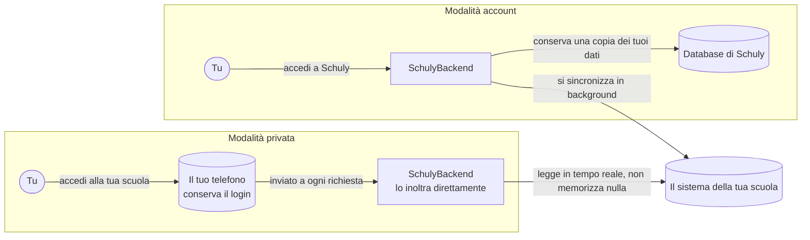

# Modalità dell'app

Schuly funziona in una delle due modalità, scelta al gate. Entrambe leggono gli
stessi sistemi scolastici dallo stesso catalogo del backend; la differenza sta in
**chi autentica l'utente** e **dove finiscono i dati**. Nessun sistema scolastico è
hardcoded nell'app - ognuno di essi proviene dal catalogo.

Entrambe le modalità finiscono per leggere lo stesso sistema scolastico. Ciò che
cambia è dove viene conservato il tuo login e se una parte dei dati finisce per
risiedere su un server.

## Cosa fa la modalità privata sul dispositivo

- Il login della scuola viene scritto nel **keystore del dispositivo** e non lo
  lascia mai, se non quando viene inviato al sistema scolastico tramite gli endpoint
  proxy anonimi del backend.
- La schermata di connessione è generica: mostra esattamente i campi di login che il
  catalogo elenca per la tua scuola, e segue la `privateAuthStrategy` dichiarata -
  `token` (un login headless genera un bearer token e una sessione rinnovabile) o
  `scrape` (le credenziali vengono riutilizzate a ogni richiesta).
- Se la tua scuola usa un codice monouso, il relativo seed viene custodito insieme al
  resto, e la schermata **Authenticator** genera i codici direttamente sul
  dispositivo.
- Quando una sessione scade, l'app si riconnette silenziosamente a partire dal
  keystore, quindi non ti viene richiesto di accedere di nuovo.

|                     | Modalità account                | Modalità privata / sicura                            |
| ------------------- | -------------------------------- | ------------------------------------------------------ |
| Autenticazione a Schuly | OIDC (Keycloak) bearer       | **nessuna**                                            |
| Client HTTP         | `ApiClient` (interceptor di auth) | `Dio` puro, solo endpoint anonimi                     |
| Dove risiedono i dati | lato server, in Postgres       | **solo sul dispositivo**                               |
| Ruolo del backend   | memorizza + sincronizza in background | proxy live senza stato, non memorizza nulla        |
| Selezione del provider | per account connesso          | `privateAuthStrategy` del catalogo (`token` / `scrape`) |
