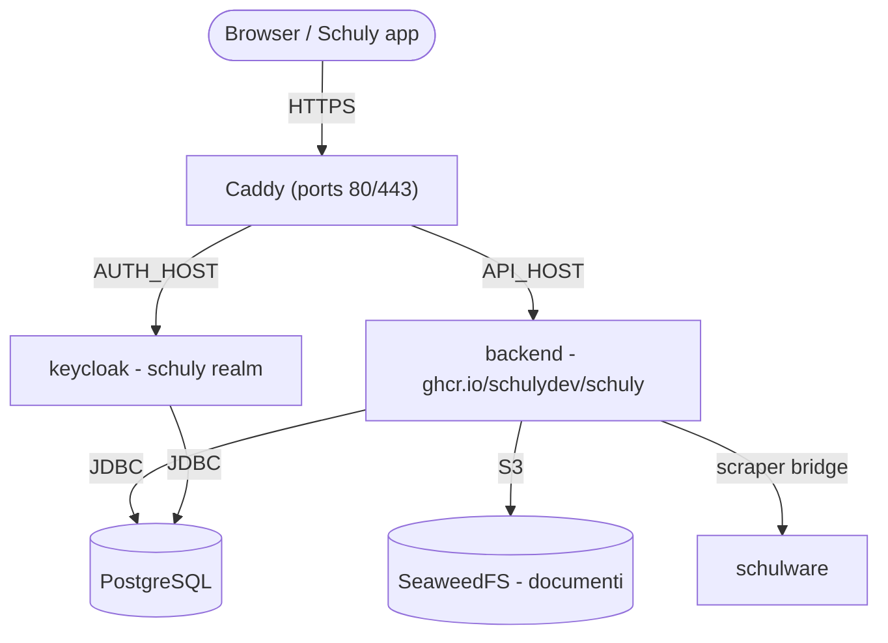

# Self-hosting

Una guida da zero per mettere in piedi il backend Schuly **e i servizi di cui ha
bisogno** sul tuo server, usando le immagini GHCR pubblicate e lo stack già pronto
in [`deploy/`](https://github.com/schulydev/SchulyBackend/tree/main/deploy). Tutto
gira dietro [Caddy](https://caddyserver.com/) con HTTPS automatico.

Per lo sviluppo locale vedi invece [Sviluppo](development.md). Per i dettagli su
immagine/release e l'elenco completo delle impostazioni, vedi
[Produzione](production.md) e [Configurazione](configuration.md).

## Cosa eseguirai



| Servizio | Immagine | Esposto |
|---|---|---|
| `caddy` | `caddy:2` | **80 / 443** - le uniche porte pubbliche |
| `backend` | `ghcr.io/schulydev/schuly` | via Caddy → `https://${API_HOST}` |
| `keycloak` | `ghcr.io/schulydev/schulykeycloak` | via Caddy → `https://${AUTH_HOST}` |
| `postgres` | `postgres:18.1` | interno (database `schuly` e `keycloak`) |
| `seaweedfs` | `chrislusf/seaweedfs` | interno - storage documenti S3 |
| `schulware` | `ghcr.io/pianonic/schulwareapi` | interno - bridge Schulnetz per il plugin Schulware |

Il backend convalida i token OIDC rispetto al realm Keycloak `schuly`, applica le
proprie migrazioni EF Core automaticamente all'avvio e scarica dal registro i
plugin dichiarati in `config/plugins.yml` (nessuna DLL di plugin è integrata
nell'immagine).

## Prerequisiti

- Un server Linux con **Docker** e il **plugin Compose** (`docker compose`).
- Le porte **80** e **443** aperte verso internet.
- Due record DNS che puntano al server - uno per l'API, uno per Keycloak
  (ad es. `api.schuly.example` e `auth.schuly.example`). Caddy ha bisogno che
  siano risolvibili prima del primo avvio, affinché Let's Encrypt possa emettere
  i certificati.

## 1. Recupera i file di deploy

Clona il repository (o copia solo la sua cartella `deploy/`) sul server ed entraci:

```sh
git clone https://github.com/schulydev/SchulyBackend.git
cd SchulyBackend/deploy
```

Tutto ciò che segue viene eseguito da `deploy/`, che si presenta così prima che tu
abbia toccato qualcosa:

```
deploy/
├── .env.example
├── Caddyfile
├── compose.staging.yml
├── config/
│   ├── backend.env
│   ├── keycloak.env
│   ├── plugins.yml
│   ├── plugins-config/
│   │   └── Schuly.Plugin.Schulware.yml
│   ├── postgres-init/
│   │   └── 01-create-keycloak-db.sh
│   └── seaweedfs/
│       └── s3-config.json
└── README.md
```

Alla fine di questa guida avrai anche `.env` (passo 3, a partire da
`.env.example`) e una cartella `data/` (creata automaticamente al primo `up`,
passo 5) che contiene tutto ciò che lo stack conserva:

```
deploy/
├── .env                  # ← lo crei tu
├── ...                   #   (file invariati omessi)
└── data/                 # ← creata al primo `docker compose up`
    ├── postgres/
    ├── seaweedfs/
    ├── plugins/           # DLL dei plugin scaricate
    ├── caddy/              # certificati/stato TLS
    └── caddy-config/
```

## 2. Punta il DNS verso il server

Crea i record A/AAAA per i tuoi due hostname e attendi che si risolvano verso
l'IP pubblico del server. Finché non lo fanno, l'emissione del certificato
fallirà.

## 3. Configura i segreti

Copia il template e compilalo:

```sh
cp .env.example .env
```

| Variabile | Cosa impostare |
|---|---|
| `API_HOST` | Hostname pubblico per l'API, ad es. `api.schuly.example`. |
| `AUTH_HOST` | Hostname pubblico per Keycloak, ad es. `auth.schuly.example`. |
| `SCHULY_VERSION` | Tag dell'immagine del backend. `latest` segue ogni release; fissa una versione come `1.3.3` per decidere tu stesso quando aggiornare. |
| `KEYCLOAK_VERSION` | Tag dell'immagine Keycloak, stessa logica. |
| `POSTGRES_USER` | Utente del database (condiviso da backend e Keycloak). |
| `POSTGRES_PASSWORD` | Una password del database robusta. |
| `KC_ADMIN_USER` | Nome utente admin di bootstrap di Keycloak (realm master). |
| `KC_ADMIN_PASSWORD` | Password admin di bootstrap di Keycloak. |
| `S3_ACCESS_KEY` | Access key S3 di SeaweedFS. |
| `S3_SECRET_KEY` | Secret key S3 di SeaweedFS. |
| `AVATAR_SIGNING_KEY` | Chiave HMAC per firmare gli URL degli avatar (obbligatoria). Generala con `openssl rand -hex 32`. |
| `SMTP_HOST`, `SMTP_PORT`, `SMTP_FROM`, `SMTP_USER`, `SMTP_PASSWORD`, `SMTP_SSL`, `SMTP_STARTTLS` | Facoltativo. Server di posta per il realm Keycloak - necessario per le email verificate e il reset password self-service. |

> Le credenziali S3 **devono corrispondere** a `config/seaweedfs/s3-config.json` -
> aggiorna sia `.env` sia quel file con gli stessi valori, altrimenti lo storage
> dei documenti non si autenticherà.

> I valori `SMTP_*` vengono incorporati nel realm quando questo viene importato
> per la **prima volta**. Modificarli in seguito non ha alcun effetto su un realm
> esistente - modifica invece **Realm settings → Email** nella console di
> amministrazione di Keycloak. Lasciarli non impostati va bene; il realm viene
> allora importato senza un server di posta funzionante.

### Dove vivono le altre impostazioni

`.env` contiene ciò che cambia per ogni deployment. Le impostazioni proprie delle
due applicazioni si trovano accanto agli altri file di configurazione, e leggono
i valori `${...}` direttamente da `.env`:

| File | Contiene |
|---|---|
| [`config/backend.env`](https://github.com/schulydev/SchulyBackend/blob/main/deploy/config/backend.env) | Impostazioni del backend - connessione al database, OIDC, S3, percorsi dei plugin. |
| [`config/keycloak.env`](https://github.com/schulydev/SchulyBackend/blob/main/deploy/config/keycloak.env) | Impostazioni di Keycloak - database, hostname, header proxy, admin di bootstrap, SMTP. |

Normalmente non tocchi nessuno dei due; esistono affinché `compose.staging.yml`
resti leggibile come rappresentazione dello stack, invece che un muro di
variabili d'ambiente.

## 4. (Facoltativo) Rivedi i plugin

`config/plugins.yml` elenca i plugin che il backend carica all'avvio (di default
il plugin Schulware), e `config/plugins-config/` contiene la configurazione di
ciascun plugin. Ogni plugin **fornisce anche una propria voce nel catalogo dei
sistemi scolastici** - il sistema che l'app mostra nel suo selettore (Schulware
contribuisce `schulnetz`, OdaOrg `odaorg`) - quindi installare un plugin aggiunge
automaticamente il suo sistema, senza configurazione del catalogo. I valori
predefiniti funzionano già così come sono; modificali solo se necessario.

## 5. Avvia lo stack

```sh
docker compose -f compose.staging.yml up -d
docker compose -f compose.staging.yml logs -f backend
```

Al primo avvio: Postgres crea i database `schuly` e `keycloak`, Keycloak importa
il realm `schuly`, il backend applica le proprie migrazioni e popola il catalogo
dei sistemi scolastici a partire dai plugin caricati, e Caddy ottiene i
certificati TLS per entrambi gli hostname.

## 6. Verifica end-to-end

- `https://${AUTH_HOST}` → la console di amministrazione di Keycloak. Accedi al
  realm master con `KC_ADMIN_USER` / `KC_ADMIN_PASSWORD`; il realm `schuly`
  dovrebbe già esistere.
- `https://${API_HOST}/api/app/school-systems` → l'endpoint anonimo del catalogo,
  a conferma che l'API è attiva (`/api/app` è l'unica rotta non autenticata).
- `https://${API_HOST}/api/app` → la configurazione dell'app (anch'essa anonima);
  il suo campo `version` riporta la versione del backend in esecuzione - utile
  per confermare un deploy o un aggiornamento.
- `https://${API_HOST}/api/plugins` → i plugin caricati (richiede un login
  `Administrator`). Gestiscili a runtime con `POST /api/plugins/install` e
  `DELETE /api/plugins/{name}`.
- Punta l'app Schuly verso `https://${API_HOST}`. Il suo login pilota Keycloak
  tramite il client `schuly-app`; poiché sia l'app sia il backend usano
  `https://${AUTH_HOST}` come authority OIDC, l'issuer del token corrisponde e la
  convalida va a buon fine.

## 7. Crea il tuo primo login

L'admin di bootstrap (`KC_ADMIN_USER` / `KC_ADMIN_PASSWORD`) accede solo al
**realm master** di Keycloak - la console di amministrazione, non l'app Schuly in
sé. Per ottenere un login che funzioni nell'app, crea un utente nel realm
**schuly**:

1. Nella console di amministrazione di Keycloak, cambia il selettore del realm
   (in alto a sinistra) da `master` a `schuly`.
2. **Users → Add user.** Imposta uno username (ed eventualmente un'email, se hai
   configurato SMTP).
3. **Scheda Credentials → Set password.** Disattiva "Temporary" a meno che tu non
   voglia essere invitato a cambiarla al primo accesso.
4. **Scheda Groups → Join group.** Aggiungi l'utente a `Student`, `Teacher` o
   `Administrator` - il backend legge il claim `groups` come ruolo dell'app, e
   solo `Administrator` può gestire i plugin tramite l'API.

Quell'utente può ora accedere dall'app Schuly in modalità privata - puntala verso
`https://${API_HOST}` e da lì pilota Keycloak.

## 8. Blinda per la produzione

Il realm `schuly` incluso fornisce un client PKCE `schuly-app` di tipo
**starter** e i gruppi Student / Teacher / Administrator (mappati sul claim
`groups` che il backend legge come ruoli). Prima di un uso reale:

- Sostituisci il realm starter con un export vero e proprio, e ruota ogni segreto
  in `.env`.
- Crea un vero admin Keycloak e rimuovi le variabili di bootstrap `KC_ADMIN_*`
  (vedi la documentazione di self-hosting del progetto SchulyKeycloak per i passi
  specifici di Keycloak).
- Mantieni i servizi di gestione/interni non esposti - solo Caddy dovrebbe
  pubblicare porte.

## Esecuzione senza un dominio pubblico (LAN / test locali)

Tutto quanto sopra presuppone un dominio reale con DNS sotto il tuo controllo,
così che Caddy possa ottenere un certificato Let's Encrypt. Se vuoi solo eseguire
lo stack sulla tua rete locale - facendo test verso un telefono via Wi-Fi, senza
dominio, senza TLS - alcune cose cambiano.

**Keycloak firma i token con un URL issuer fisso (`KC_HOSTNAME`), e il backend
convalida i token in ingresso recuperando i metadati esattamente da quell'URL.**
Quindi qualunque cosa tu metta in `API_HOST`/`AUTH_HOST` deve risolversi in modo
**identico** sia per il container del backend sia per qualunque cosa esegua la
tua app (telefono, browser, emulatore) - se finiscono su indirizzi diversi,
l'issuer non corrisponderà e ogni login fallirà.

Due modi per ottenere un hostname stabile senza un dominio reale:

- **L'IP LAN della tua macchina, usato direttamente** - `API_HOST=AUTH_HOST=192.168.1.42`,
  senza alcun hostname. Il più semplice, e raggiungibile da un telefono sulla
  stessa Wi-Fi. Docker Desktop permette in modo affidabile a un container di
  raggiungere una porta pubblicata sull'IP LAN dell'host stesso (una connessione
  "hairpin" che esce di nuovo attraverso l'host e vi rientra), quindi il backend
  può comunque raggiungere Keycloak in questo modo senza alcun cablaggio di rete
  aggiuntivo - confermato funzionante nella pratica. Svantaggio: si rompe se l'IP
  cambia (nuovo lease DHCP), ed è raggiungibile solo da quella rete.
- **Un hostname DNS jolly (wildcard) puntato sul tuo IP LAN**, ad es. `<ip>.nip.io`
  o `<ip>.sslip.io` - questi si risolvono pubblicamente esattamente verso l'IP
  codificato nel nome. Più elegante di un IP nudo, ma **molti router consumer lo
  bloccano**: la protezione DNS-rebind (attiva di default sulla maggior parte dei
  router FritzBox/AVM, tra gli altri) rifiuta di risolvere un hostname pubblico
  che punta a un indirizzo privato, quindi il nome non si risolverà per nessuno
  su quella rete. Se le risoluzioni falliscono misteriosamente senza un errore
  utile, è quasi sempre questo il motivo - ripiega sull'IP nudo.

Con entrambe le opzioni, dato che `API_HOST` e `AUTH_HOST` sono ora lo stesso
indirizzo, Caddy non può più distinguere i due servizi tramite l'hostname - usa
invece porte distinte.

### Esempio pratico

Supponi che l'IP LAN della tua macchina sia `192.168.1.42`. Nulla della struttura
della cartella `deploy/` dal passo 1 cambia - stai modificando quattro dei file
esistenti sul posto, niente di più:

```
deploy/
├── .env                  ← crealo da .env.example; API_HOST/AUTH_HOST = l'IP LAN
├── Caddyfile              ← modifica: HTTP semplice, porte esplicite, nessun routing per hostname
├── compose.staging.yml    ← modifica: porte del servizio caddy
├── config/
│   ├── backend.env        ← modifica: RequireHttpsMetadata=false
│   ├── keycloak.env        (invariato - KC_HTTP_ENABLED è già true)
│   ├── plugins.yml         (invariato)
│   ├── plugins-config/
│   │   └── Schuly.Plugin.Schulware.yml   (invariato)
│   ├── postgres-init/
│   │   └── 01-create-keycloak-db.sh      (invariato)
│   └── seaweedfs/
│       └── s3-config.json                (invariato)
└── data/                  (creata al primo `up`, come nel caso del dominio)
```

**`.env`** - stesso template del passo 3, punta semplicemente entrambi gli
hostname verso l'IP nudo e lascia `SMTP_*` commentato per un test rapido:

```sh
API_HOST=192.168.1.42
AUTH_HOST=192.168.1.42
SCHULY_VERSION=latest
KEYCLOAK_VERSION=latest
POSTGRES_USER=schuly
POSTGRES_PASSWORD=change-me-postgres
KC_ADMIN_USER=admin
KC_ADMIN_PASSWORD=change-me-kc-admin
S3_ACCESS_KEY=schuly-access
S3_SECRET_KEY=change-me-s3-secret
AVATAR_SIGNING_KEY=change-me-avatar-signing-key
```

**`Caddyfile`** - sostituisci l'intero file (la versione basata su dominio
ottiene un certificato TLS per hostname; questa qui fa solo da proxy per porta):

```
http://{$API_HOST}:8080 {
	reverse_proxy backend:8080
}
http://{$AUTH_HOST}:8081 {
	reverse_proxy keycloak:8080
}
```

**`compose.staging.yml`** - nel servizio `caddy`, sostituisci l'elenco `ports:`
(rimuovi `443:443`, non c'è alcun certificato da servire):

```yaml
  caddy:
    image: caddy:2
    restart: unless-stopped
    ports:
      - "8080:8080"
      - "8081:8081"
    environment:
      API_HOST: ${API_HOST}
      AUTH_HOST: ${AUTH_HOST}
    volumes:
      - ./Caddyfile:/etc/caddy/Caddyfile:ro
      - ./data/caddy:/data
      - ./data/caddy-config:/config
    depends_on:
      - backend
      - keycloak
```

**`config/backend.env`** - una sola riga cambia, da `true` a `false`:

```
Oidc__RequireHttpsMetadata=false
```

Poi avvia tutto esattamente come nel passo 5:

```sh
docker compose -f compose.staging.yml up -d
docker compose -f compose.staging.yml logs -f backend
```

E verifica con gli stessi controlli del passo 6, semplicemente con `http://` e
una porta invece di `https://`:

```sh
curl http://192.168.1.42:8080/api/app/school-systems       # catalogo anonimo
curl http://192.168.1.42:8081/realms/schuly/.well-known/openid-configuration
```

Il campo `"issuer"` nella risposta del secondo comando dovrebbe leggere
esattamente `http://192.168.1.42:8081/realms/schuly` - se non corrisponde a ciò
che la tua app/browser usa per raggiungere Keycloak, si tratta del disallineamento
descritto sopra, e il login fallirà.

Tutto il resto - i passi indipendenti dal DNS come l'importazione del realm, il
caricamento dei plugin e la procedura del primo login descritta sopra -
funziona esattamente allo stesso modo. Un'ultima cosa utile da sapere: il
Windows Firewall potrebbe bloccare silenziosamente un telefono sulla stessa
Wi-Fi dal raggiungere queste porte la prima volta - consenti Docker Desktop
sulla rete **Privata** se richiesto, oppure aggiungi tu stesso una regola in
ingresso per le porte.

## Operazioni

- **Persistenza** - tutto lo stato è **montato tramite bind mount su cartelle
  dell'host sotto `./data`** (nessun volume nominato): `data/postgres`,
  `data/seaweedfs`, `data/plugins`, `data/caddy*`. Questa è la configurazione
  consigliata - i tuoi dati restano visibili e facili da salvare sull'host. Le
  cartelle vengono create al primo `up`, e un servizio one-shot `init-perms`
  rende `data/plugins` scrivibile automaticamente dall'utente del backend, così
  funziona semplicemente al primo avvio. Per azzerare tutto, ferma lo stack ed
  elimina `./data`.
- **Aggiornamenti** - imposta `SCHULY_VERSION` e `KEYCLOAK_VERSION` in `.env` su
  una versione fissa invece di `latest`, così un deploy si ripete esattamente
  identico e sei tu a scegliere quando avanzare. Cambia la versione, poi
  `up -d` per procedere. Le migrazioni girano automaticamente sul nuovo
  container; esegui un backup di `data/postgres` prima di salti di versione
  importanti.
- **Modifiche ai plugin** effettuate tramite l'API vengono salvate in
  `config/plugins.yml`.

## Riferimento: il `compose.staging.yml` completo

Per comodità, lo stack completo eseguito da questa guida (lo stesso file vive
nella cartella `deploy/` del repository). Tutto lo stato è montato tramite bind
mount sotto `./data` - nessun volume nominato - e un servizio one-shot
`init-perms` rende la cartella dei plugin scrivibile dal backend al primo
avvio, così un semplice `docker compose up` funziona.

```yaml
services:
  # One-shot: rende la cartella dei plugin montata tramite bind mount scrivibile
  # dall'utente non-root del backend (uid 1654) prima che questo si avvii, così
  # un semplice `up` funziona già al primissimo avvio senza chown manuale.
  # Viene eseguito una sola volta e termina.
  init-perms:
    image: busybox:1.37
    command: sh -c "mkdir -p /data/plugins && chown -R 1654:1654 /data/plugins"
    volumes:
      - ./data:/data
    restart: "no"

  postgres:
    image: postgres:18.1
    restart: unless-stopped
    environment:
      POSTGRES_USER: ${POSTGRES_USER}
      POSTGRES_PASSWORD: ${POSTGRES_PASSWORD}
      POSTGRES_DB: schuly
    # Crea il database aggiuntivo `keycloak` alla prima inizializzazione (i
    # database dei plugin del backend vengono creati automaticamente dalle
    # migrazioni EF).
    volumes:
      # postgres:18 conserva i dati in una sottocartella con versione, quindi
      # il mount avviene su /var/lib/postgresql (non /var/lib/postgresql/data,
      # che ora viene rifiutato).
      - ./data/postgres:/var/lib/postgresql
      - ./config/postgres-init:/docker-entrypoint-initdb.d:ro
    healthcheck:
      # -h 127.0.0.1 forza un controllo TCP. Mentre l'entrypoint esegue gli
      # script di init serve solo sul socket Unix, quindi un controllo basato
      # su socket segnalerebbe "healthy" a metà inizializzazione, lasciando che
      # i servizi dipendenti si colleghino a un server che sta per riavviarsi.
      test: ["CMD-SHELL", "pg_isready -U ${POSTGRES_USER} -d schuly -h 127.0.0.1"]
      interval: 10s
      timeout: 5s
      retries: 10

  seaweedfs:
    image: chrislusf/seaweedfs:latest
    restart: unless-stopped
    command: >
      server -dir=/data
      -s3 -s3.config=/etc/seaweedfs/s3-config.json -s3.port=8333
      -master.volumeSizeLimitMB=1024
    volumes:
      - ./data/seaweedfs:/data
      - ./config/seaweedfs/s3-config.json:/etc/seaweedfs/s3-config.json:ro

  keycloak:
    image: ghcr.io/schulydev/schulykeycloak:${KEYCLOAK_VERSION:-latest}
    restart: unless-stopped
    env_file: [./config/keycloak.env]
    depends_on:
      postgres:
        condition: service_healthy

  schulware:
    image: ghcr.io/pianonic/schulwareapi:latest
    restart: unless-stopped
    init: true        # ripulisce i processi zombie
    ipc: host         # margine di memoria condivisa per lo scraper
    environment:
      # Il client id Schulnetz e l'host PWA sono già integrati come predefiniti
      # nell'immagine SchulwareAPI, quindi qui non serve alcuna configurazione
      # Schulnetz.
      PYTHONUNBUFFERED: "1"

  backend:
    image: ghcr.io/schulydev/schuly:${SCHULY_VERSION:-latest}
    restart: unless-stopped
    env_file: [./config/backend.env]
    volumes:
      - ./data/plugins:/app/plugins                        # DLL dei plugin scaricate (cartella host)
      - ./config/plugins.yml:/app/plugins.yml              # set di plugin desiderato (scrivibile: gli endpoint lo riscrivono)
      - ./config/plugins-config:/app/plugins-config:ro     # configurazione per-plugin
    depends_on:
      postgres:
        condition: service_healthy
      init-perms:
        condition: service_completed_successfully

  caddy:
    image: caddy:2
    restart: unless-stopped
    ports:
      - "80:80"
      - "443:443"
    environment:
      API_HOST: ${API_HOST}
      AUTH_HOST: ${AUTH_HOST}
    volumes:
      - ./Caddyfile:/etc/caddy/Caddyfile:ro
      - ./data/caddy:/data
      - ./data/caddy-config:/config
    depends_on:
      - backend
      - keycloak
```
