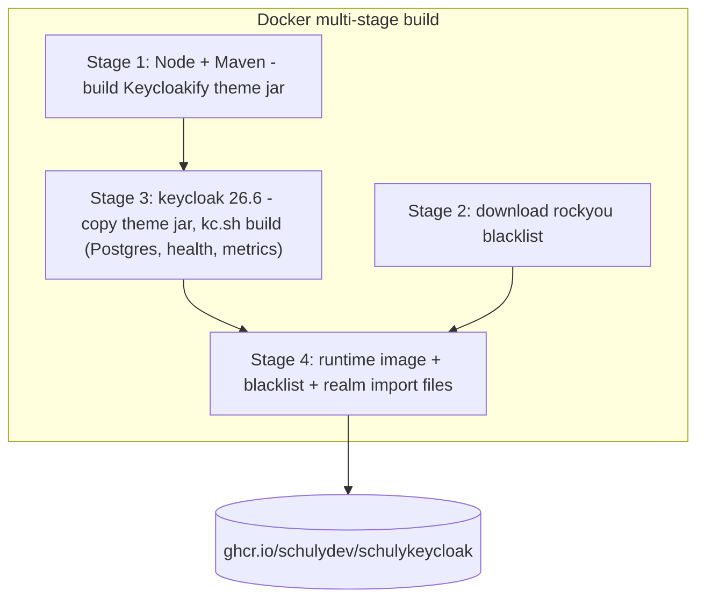
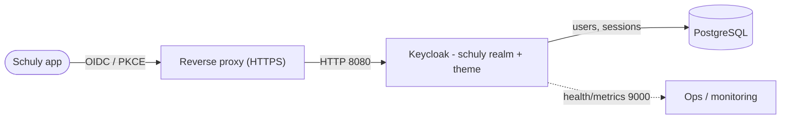

# Architettura

Come si incastrano i pezzi, e perché l'immagine è costruita in questo modo.

## Cosa contiene l'immagine

Il repository produce un'unica immagine Keycloak autosufficiente. Tre componenti
vengono integrati al momento del build, così il container di produzione non ha
bisogno di altro che di un database:

- Lo **Stage 1** compila il tema di login `keycloakify/` in un provider jar per
  Keycloak.
- Lo **Stage 2** scarica la lista rockyou delle password compromesse.
- Lo **Stage 3** copia il jar del tema ed esegue `kc.sh build` - un build
  **ottimizzato**, fissato su Postgres, con health check e metriche attivi, per un
  avvio rapido in produzione.
- Lo **Stage 4** assembla l'immagine di runtime: il server ottimizzato, la
  blacklist e i file di import del realm `schuly`.

## Perché un build ottimizzato

`kc.sh build` risolve in anticipo il vendor del database e i feature flag. Il
runtime parte poi con `start --optimized`, saltando il passaggio di build a ogni
avvio. Il compromesso: le impostazioni fissate al momento del build (in
particolare `KC_DB`) restano bloccate nell'immagine - cambiarle richiede una
ricostruzione. I dettagli di connessione e l'hostname restano invece variabili
d'ambiente a runtime. Vedi il
[riferimento di configurazione](configuration.md).

## Flusso di richiesta/login

L'app Schuly si autentica sul realm `schuly` tramite OIDC (il client pubblico
`schuly-app`, con PKCE). Keycloak serve le pagine di login personalizzate,
applica il flusso 2FA `browser-2fa` e conserva utenti e sessioni in Postgres.
Health check e metriche sono esposti separatamente sulla porta `9000`, riservata
al solo monitoraggio interno.

## Mappa dei sorgenti

Consulta la tabella sulla struttura del repository nell'[indice della
documentazione](README.md) per sapere quale file fa cosa.
