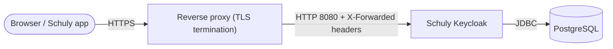

# Self-hosting

Una guida completa, pronta da copiare e incollare, per eseguire Schuly Keycloak in
produzione: il database, l'immagine Keycloak e un reverse proxy che termina il TLS
- più la configurazione dell'admin al primo accesso. Per l'elenco esaustivo di
ogni impostazione, vedi il
[riferimento di configurazione](../configuration.md).

## Lo stack



Ti servono tre cose:

1. **PostgreSQL** - il datastore di Keycloak (l'immagine è costruita per
   Postgres).
2. **L'immagine Schuly Keycloak** - `ghcr.io/schulydev/schulykeycloak:<tag>`.
3. **Un reverse proxy** che termina il TLS e inoltra a Keycloak sulla `:8080`
   (Caddy, Traefik, nginx - qualsiasi cosa imposti gli header
   `X-Forwarded-*`).

## 1. Scegli un hostname e fissa una versione

- Decidi l'URL pubblico, es. `https://auth.schuly.dev`, e punta il suo DNS al tuo
  host.
- Fissa un tag di immagine invece di `:latest`, così i deploy sono riproducibili -
  vedi [Release](release.md) per come i tag corrispondono alle versioni.

## 2. docker-compose

Questo avvia Postgres + Keycloak + un reverse proxy Caddy (Caddy fornisce
automaticamente un certificato Let's Encrypt e inoltra gli header proxy di cui
Keycloak ha bisogno).

```yaml
services:
  db:
    image: postgres:16
    restart: unless-stopped
    environment:
      POSTGRES_DB: keycloak
      POSTGRES_USER: keycloak
      POSTGRES_PASSWORD: ${DB_PASSWORD:?set DB_PASSWORD}
    volumes:
      - db-data:/var/lib/postgresql/data
    healthcheck:
      test: ["CMD-SHELL", "pg_isready -U keycloak"]
      interval: 10s
      timeout: 5s
      retries: 5

  keycloak:
    image: ghcr.io/schulydev/schulykeycloak:1.4.0   # pin a real tag
    restart: unless-stopped
    depends_on:
      db:
        condition: service_healthy
    environment:
      KC_DB_URL: jdbc:postgresql://db:5432/keycloak
      KC_DB_USERNAME: keycloak
      KC_DB_PASSWORD: ${DB_PASSWORD:?set DB_PASSWORD}
      KC_HOSTNAME: https://auth.schuly.dev
      KC_PROXY_HEADERS: xforwarded
      KC_HTTP_ENABLED: "true"
      # Bootstrap admin - used once, then removed (see step 4).
      KC_BOOTSTRAP_ADMIN_USERNAME: ${BOOTSTRAP_ADMIN_USER:?}
      KC_BOOTSTRAP_ADMIN_PASSWORD: ${BOOTSTRAP_ADMIN_PASSWORD:?}

  proxy:
    image: caddy:2
    restart: unless-stopped
    depends_on: [keycloak]
    ports:
      - "80:80"
      - "443:443"
    volumes:
      - ./Caddyfile:/etc/caddy/Caddyfile
      - caddy-data:/data

volumes:
  db-data:
  caddy-data:
```

`Caddyfile`:

```caddy
auth.schuly.dev {
    reverse_proxy keycloak:8080
}
```

Fornisci i segreti fuori banda (es. un file `.env` accanto al compose,
**non** committato):

```sh
DB_PASSWORD=change-me-long-random
BOOTSTRAP_ADMIN_USER=bootstrap
BOOTSTRAP_ADMIN_PASSWORD=change-me-too
```

Sono tre file, organizzati così:

```
schuly-keycloak/
├── compose.yml     # the docker-compose.yml above
├── Caddyfile        # the Caddyfile above
└── .env             # the secrets above - not committed
```

Avvia tutto:

```sh
docker compose up -d
```

> Viene proxata solo la `:8080`. La porta di management `:9000`
> (health/metriche) **non** è pubblicata e non deve mai essere esposta a
> Internet.

## 3. Verifica che sia in salute

```sh
# from another container on the same network, or exec into the keycloak container
curl -fsS http://keycloak:9000/health/ready
```

Apri poi `https://auth.schuly.dev/` - dovresti vedere la pagina di login
personalizzata Schuly, e il realm `schuly` dovrebbe esistere (viene importato al
primo avvio).

## 4. Crea un admin vero, rimuovi quello di bootstrap

Le credenziali `KC_BOOTSTRAP_ADMIN_*` sono un account temporaneo e ben noto. Non
appena lo stack è online:

1. Accedi alla console di amministrazione del realm master su
   `https://auth.schuly.dev/admin/`.
2. Crea un nuovo utente admin con una password forte (realm **master** → Users).
3. Rimuovi `KC_BOOTSTRAP_ADMIN_USERNAME` / `KC_BOOTSTRAP_ADMIN_PASSWORD`
   dall'ambiente del compose e riesegui `docker compose up -d`. L'account di
   bootstrap esiste solo finché quelle variabili sono impostate al primo avvio.

> **Sicurezza:** non lasciare mai le credenziali dell'admin di bootstrap in un
> deployment attivo a lungo termine, e non committare mai segreti reali (password
> del database, password admin) né metterli in `realms/schuly-realm.json`.
> Imposta sempre `KC_HOSTNAME` sul tuo vero URL HTTPS e termina il TLS sul proxy.

## 5. Aggiornamenti

Per passare a un'immagine più recente, cambia il tag fissato ed esegui
`docker compose up -d`. I dati del realm e degli utenti vivono in Postgres e
persistono attraverso gli aggiornamenti dell'immagine; un realm già importato
resta invariato (il file del realm incluso inizializza solo un database
completamente nuovo). Esegui un backup del volume Postgres prima di salti di
versione Keycloak importanti.

## Funzionare senza un dominio pubblico (LAN / test locali)

Tutto quanto sopra presuppone un dominio vero con un DNS che controlli. Potresti
non averne uno - per esempio se stai sviluppando contro un backend eseguito in
locale (secondo la
[guida allo sviluppo di SchulyBackend](https://docs.schuly.dev/it/SchulyBackend/setup/development))
e ti serve semplicemente un Keycloak vero, basato sull'immagine pubblicata,
raggiungibile sulla tua rete - senza dominio, senza TLS. (Il `compose.dev.yml` di
`setup/development.md` è un'altra cosa - costruisce l'immagine dai sorgenti per
il lavoro sul tema; qui si tratta di eseguire l'immagine di produzione senza un
dominio.)

**`KC_HOSTNAME` è l'URL a cui viene impostato l'issuer di ogni token**, e tutto
ciò che valida quei token (un backend, un browser, un telefono) deve poter
raggiungere Keycloak esattamente sotto quell'URL - un semplice `localhost`
funziona solo se tutto gira sulla stessa macchina. Vedi la
[guida al self-hosting di SchulyBackend](https://docs.schuly.dev/it/SchulyBackend/setup/self-hosting#running-without-a-public-domain-lan-local-testing)
per la spiegazione completa, incluso il motivo per cui un hostname DNS
wildcard come `<ip>.nip.io` spesso non si risolve silenziosamente sui router
domestici (protezione anti-DNS-rebind) e perché un IP LAN grezzo è il fallback
più affidabile.

Una volta scelto un hostname (diciamo l'IP LAN della tua macchina,
`192.168.1.42`), cambiano tre cose rispetto al passaggio 2 sopra:

```yaml
# compose.yml - keycloak service
environment:
  KC_HOSTNAME: http://192.168.1.42:8080   # was https://auth.schuly.dev

# proxy (caddy) service
ports:
  - "8080:8080"   # was "80:80" / "443:443" - no cert to serve, so no 443
```

```
# Caddyfile - plain HTTP, explicit port, no ACME
http://192.168.1.42:8080 {
	reverse_proxy keycloak:8080
}
```

Tutto il resto - l'import del realm, il passaggio dell'admin di bootstrap, la
verifica - resta invariato, solo con `http://` invece di `https://`. Qualunque
altra cosa andrà a validare i token emessi da questo Keycloak (es. un
SchulyBackend self-hosted) dovrà a sua volta allentare il proprio requisito sui
metadati HTTPS - vedi la documentazione di quel progetto.

## Prossimi passi

- [Riferimento di configurazione](../configuration.md) - ogni porta, variabile e valore predefinito.
- [Gestione del realm](../realm-management.md) - modificare e salvare il realm `schuly`.
- [Risoluzione dei problemi](../troubleshooting.md) - quando qualcosa non si avvia.
